# 【UEFI】Windows和Linux下的环境搭建

 > Author: Sam Diao
 > Date: 2024-09-24
 > Rev

## 1. Windows下的UEFI环境搭建

-------------------

> 主逻辑：
> ① 下载EDK2及其它必要的开发包，并安装EDK2所需的开发工具(VS2019、Python、NASM、IASL、Git、Cygwin)
> ② 配置EDK2开发环境
> ③ 编译UEFI模拟器和示例程序
> ④ 启动模拟器并运行编译好的示例程序

### 1.1 安装EDK2所需的开发工具(基于Windows10 21H1 19043.1826)

NASM、IASL、Cygwin和EDK2相关开发包我都放在了C盘根目录下的UEFIWorkspace文件夹中，其他工具安装位置自行决定

#### 1.1.1 C/C++编译器(VS2019，因为目前的EDK2只支持到2019)

[https://learn.microsoft.com/zh-cn/visualstudio/releases/2019/redistribution#vs2019-download/](https://learn.microsoft.com/zh-cn/visualstudio/releases/2019/redistribution#vs2019-download/)

在安装VS2019时要勾选CMake工具


#### 1.1.2 Python3(我安装的是3.9)

[https://www.python.org/](https://www.python.org/ "https://www.python.org/")

#### 1.1.3 NASM(2.15及以上)

[https://www.nasm.us/](https://www.nasm.us/ "https://www.nasm.us/")

#### 1.1.4 ASL

[https://acpica.org/downloads/binary-tools](https://acpica.org/downloads/binary-tools "https://acpica.org/downloads/binary-tools")

#### 1.1.5 Git

[https://git-scm.com/](https://git-scm.com/ "https://git-scm.com/")

#### 1.1.6 Cygwin

[http://www.cygwin.com/setup-x86\_64.exe](http://www.cygwin.com/setup-x86_64.exe "http://www.cygwin.com/setup-x86_64.exe")

#### 1.1.7 EDK2及其它必要开发包(通过Git工具下载)

[http://github.com/tianocore/edk2.git](http://github.com/tianocore/edk2.git "http://github.com/tianocore/edk2.git")  
[http://github.com/tianocore/edk2-libc.git](http://github.com/tianocore/edk2-libc.git "http://github.com/tianocore/edk2-libc.git")

#### 1.1.8 环境变量设置，如下

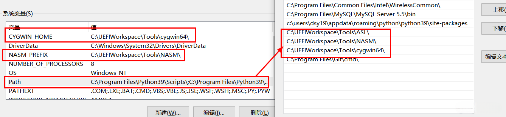

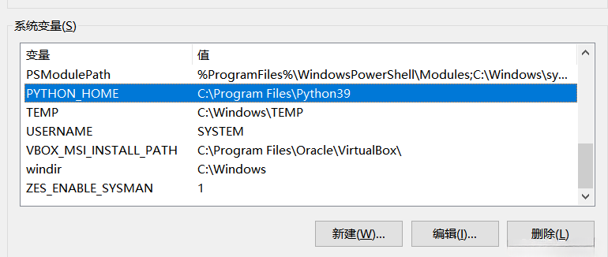

 注：这里我就踩了坑，因为我有强迫症，为了保持所有工具安装位置的统一，我将所有工具都放在UEFIWorkspace\Tools下，这时候对于ASL来说需要调整edk2\BaseTools\set\_vsprefix\_envs.bat中关于IASL\_PREFIX的地址定义，如下：

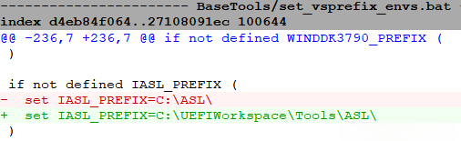

如果你不想单独修改地址定义，那你的ASL工具就必须装在C盘根目录中，否则会在后面的编译过程中遇到以下错误：

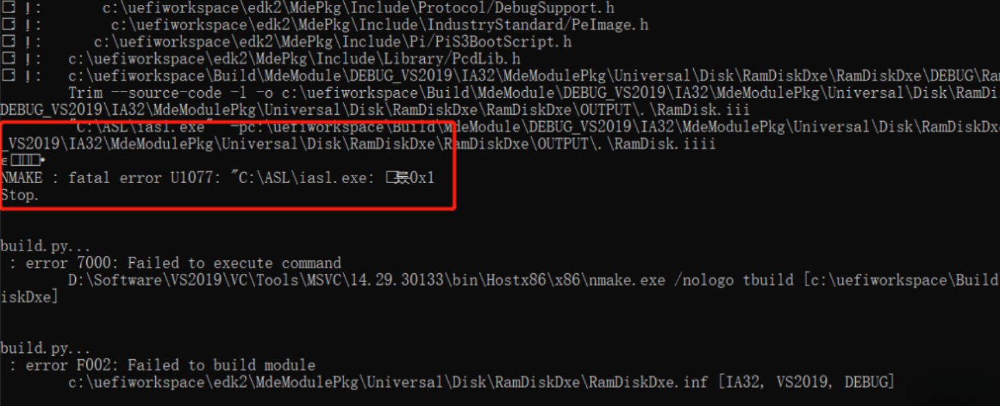

### 1.2 配置EDK2开发环境

#### 1.2.1 更新EDK2 Submodule

仅首次需要加 --init，以后再更新就不需要了，如果update失败的话，请看文末的注1

```shell
git submodule update --init
```

####  1.2.2 编译BaseTools(使用x86/64 Native Tools Command Prompt for VS2019)

```shell
C:\UEFIWorkspace\edk2>edksetup.bat Rebuild
```

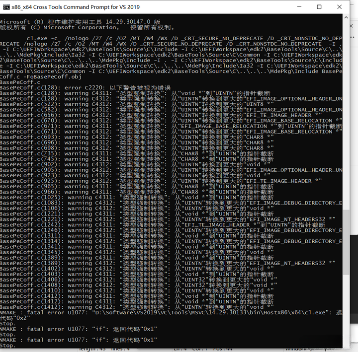

如果遇到上面的类型转换报错，请更换为32位的编译器重试

#### 1.2.3 设置开发工具地址(在UEFIWorkspace下新建mybuild.bat，并添加以下内容)

```shell
set WORKSPACE=%CD%
set EDK_TOOLS_PATH=%CD%\edk2\BaseTools
set CONF_PATH=%CD%\edk2\Conf
set PACKAGES_PATH=%CD%\edk2;%CD%\edk2-libc
```

#### 1.2.4 检查edk2/Conf下的配置文件(主要是target.txt和tools\_def.txt，前者包含编译的默认参数，后者规定了编译工具链)

我根据自己的配置情况修改了target.txt中的以下两个参数：

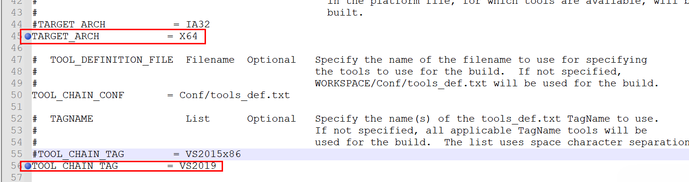

### 1.3 编译UEFI模拟器和UEFI程序(使用x86/64 Native Tools Command Prompt for VS 2019)

#### 1.3.1 设置环境变量

```shell
C:\UEFIWorkspace>mybuild.bat
C:\UEFIWorkspace>edk2\edksetup.bat
```

#### 1.3.2 编译UEFI模拟器

```shell
C:\UEFIWorkspace>build -p edk2\EmulatorPkg\EmulatorPkg.dsc -t VS2019 -a X64
```

#### 1.3.3 编译UEFI程序

```shell
C:\UEFIWorkspace>build -p edk2-libc\AppPkg\AppPkg.dsc -t VS2019 -a
```

### 1.4 用UEFI模拟器运行UEFI程序(使用x86/64 Native Tools Command Prompt for VS 2019)

#### 1.4.1 运行UEFI模拟器

```shell
C:\UEFIWorkspace\Build\EmulatorX64\DEBUG\_VS2019\X64>WinHost.exe
```

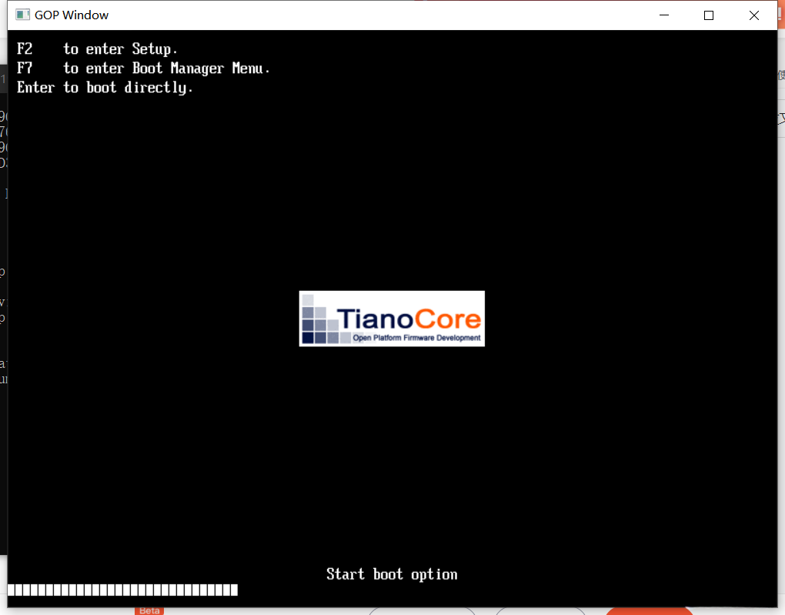

#### 1.4.2 运行UEFI程序(以HelloWorld.efi为例)

```shell
> Shell>fs0:
> FS0:\>HelloWorld.efi
```

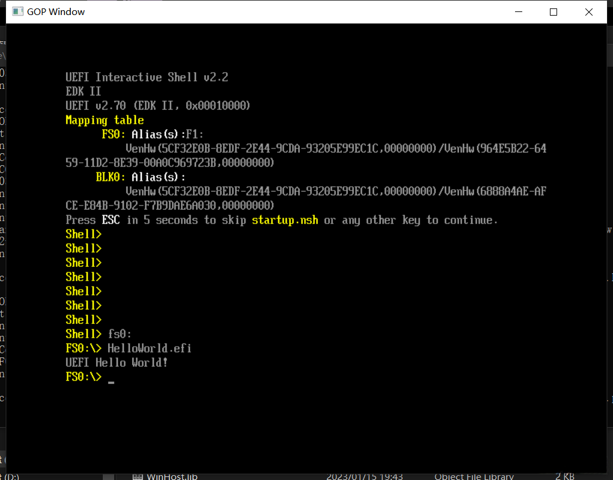

## 2. Linux下的UEFI环境搭建

-------------------

> 主逻辑：
>
> 1. 下载EDK2及其它必要的开发包，并安装EDK2所需的开发工具(Git、Python3、UUID-DEV、NASM、BISON、FLEX、GCC、MAKE)
>    UUID-DEV: 用于编译所需要的源文件
>    NASM: 用于编译X86汇编代码
>    BISON和FLEX: 用于编译ACPICA工具时使用
> 2. 配置Linux下开发环境
> 3. 编译UEFI模拟器和示例程序
> 4. 启动模拟器并运行编译好的示例程序

### 2.1 安装EDK2所需的开发工具(基于Ubuntu 20.04.2 LTS)

#### 2.1.1 安装Git

```shell
$ sudo apt install git
$ git --version
git version 2.25.1
```

#### 2.1.2 安装Python3

```shell
$ sudo apt install python3  
$ python3 --version  
Python 3.8.10
```

#### 2.1.3 安装UUID-DEV、NASM、BISON、FLEX

```shell
sudo apt install uuid-dev nasm bison flex
```

#### 2.1.4 安装GCC、MAKE

```shell
$ sudo apt-get install build-essential
$ gcc --version
gcc (Ubuntu 9.4.0-1ubuntu1~20.04.1) 9.4.0
$ make --version  
GNU Make 4.2.1
```

#### 2.1.5 下载EDK2和其他必要开发包

我将所有的开发包都放置在了桌面上的UEFIWorkspace中，前两个用于编译UEFI程序，第三个用于编译ACPI工具

```shell
~/Desktop/UEFIWorkspace$ git clone http://github.com/tianocore/edk2.git
~/Desktop/UEFIWorkspace$ git clone http://github.com/tianocore/edk2-libc.git
~/Desktop/UEFIWorkspace$ git clone http://github.com/acpica/acpica.git
```

### 2.2 配置开发环境

#### 2.2.1 更新SubModule

仅首次需要加 --init，以后再更新就不需要了，如果update失败的话，请看文末的注1

```shell
~/Desktop/UEFIWorkspace/edk2$ git submodule update --init
```

#### 2.2.2 编译BaseTools

```shell
~/Desktop/UEFIWorkspace$ make -C edk2/BaseTools
```

踩坑，在编译中遇到下面截图的问题：

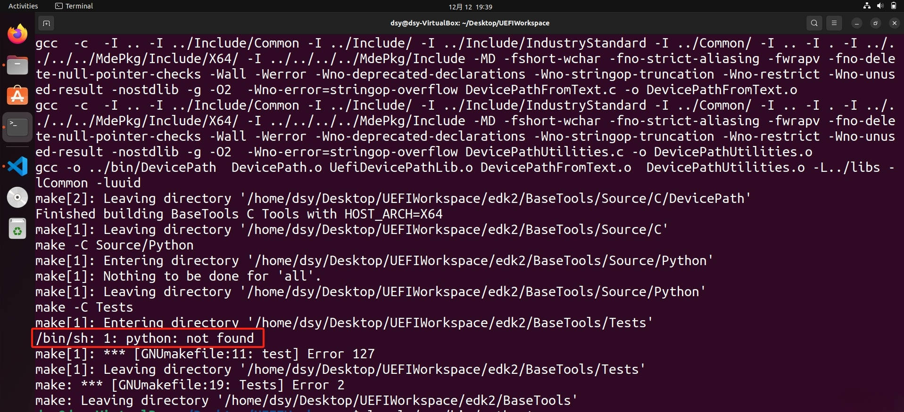

最终经过检查发现这是python没有做映射，需要将python3映射到python指令上。

```shell
~/Desktop/UEFIWorkspace$ sudo ln -s /usr/bin/python3 /usr/bin/python
```

#### 2.2.3 编译ACPICA

```shell
~/Desktop/UEFIWorkspace$ make -C acpica/
```

 踩坑，在编译ACPICA中遇到下面截图的问题：

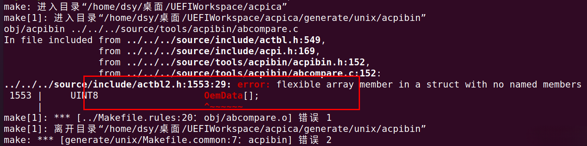

最终经过检查发现这是ACPICA的代码错误，在acpica的github request pull #821已经提供了解决办法，修改后即可正常编译通过了。

[actbl2: Fix compilation of ACPI\_MADT\_OEM\_DATA on gcc and clang by heatd · Pull Request #821 · acpica/acpica · GitHub](https://github.com/acpica/acpica/pull/821/commits/9fab88ffeeaa00f08ff0944cb27e192516942402 "actbl2: Fix compilation of ACPI_MADT_OEM_DATA on gcc and clang by heatd · Pull Request #821 · acpica/acpica · GitHub")

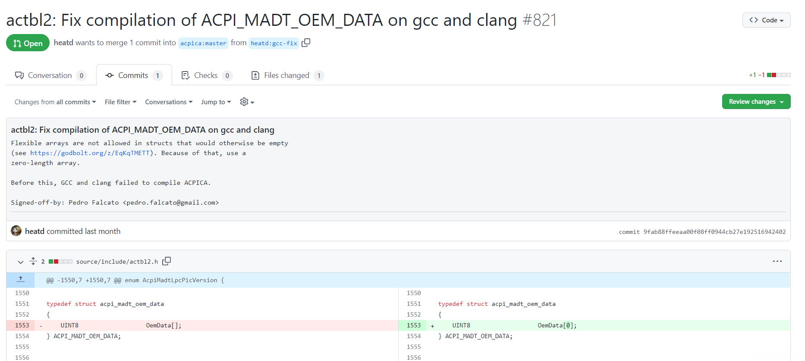

#### 2.2.4 设置开发工具地址(在UEFIWorkspace下新建myexport.sh，并添加以下内容)

```shell
export WORKSPACE=$PWD
export PACKAGES_PATH=$PWD/edk2:$PWD/edk2-libc
export IASL_PREFIX=$PWD/acpica/generate/unix/bin/
export PYTHON_COMMAND=/usr/bin/python3
```

### 2.3 编译UEFI模拟器和UEFI程序

#### 2.3.1 编译UEFI模拟器

```shell
~/Desktop/UEFIWorkspace$ source myexport.sh
~/Desktop/UEFIWorkspace$ source edk2/edksetup.sh
~/Desktop/UEFIWorkspace$ build -p edk2/EmulatorPkg/EmulatorPkg.dsc -t GCC5 -a X64
```

踩坑，遇到下面这个问题，最终通过更新NASM到2.15或以上版本解决

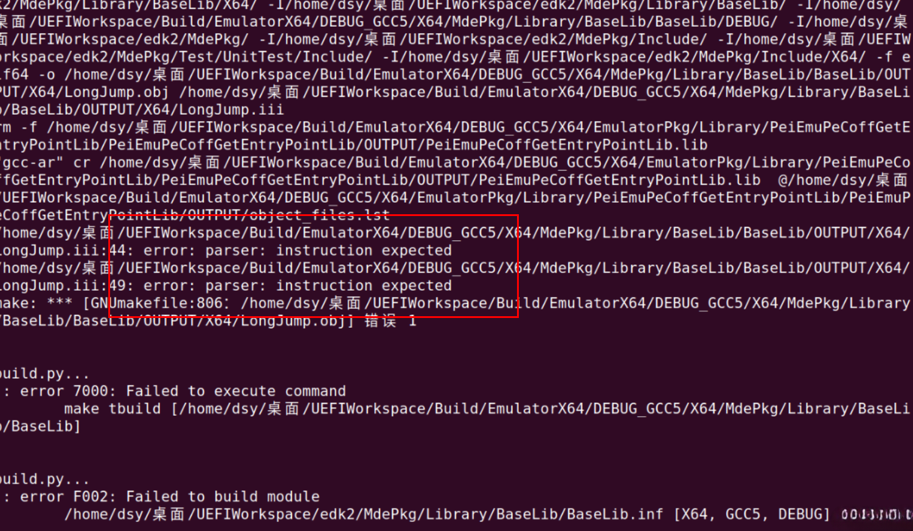

踩坑，遇到下面这个问题：

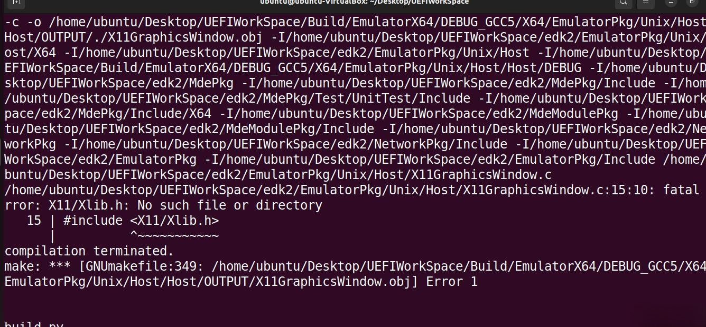

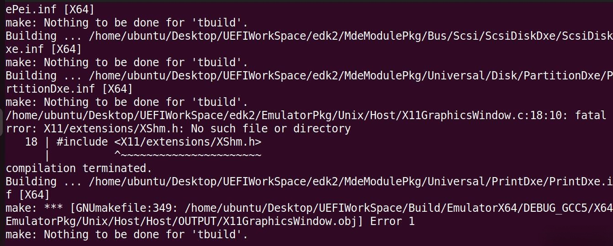

解决方案：

```shell
sudo apt-get install x11proto-xext-dev  
sudo apt-get install libx11-dev
sudo apt-get install libxext-dev
```

#### 2.3.2 编译UEFI程序

```shell
~/Desktop/UEFIWorkspace$ build -p edk2-libc/AppPkg/AppPkg.dsc -t GCC5 -a X64
```

### 2.4 用UEFI模拟器运行UEFI程序

#### 2.4.1 运行UEFI模拟器

```shell
~/Desktop/UEFIWorkspace/Build/EmulatorX64/DEBUG\_GCC5/X64$ ./Host
```

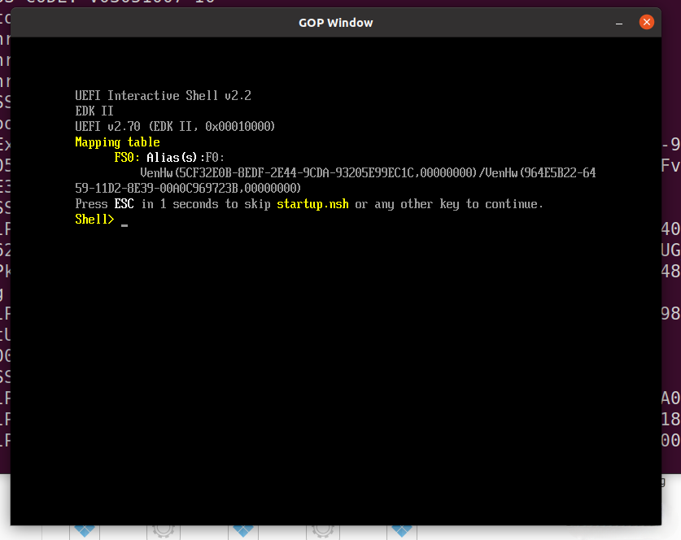

#### 2.4.2 运行UEFI程序(以HelloWorld.efi为例)

```shell
Shell>fs0:
FS0:\>HelloWorld.efi
```

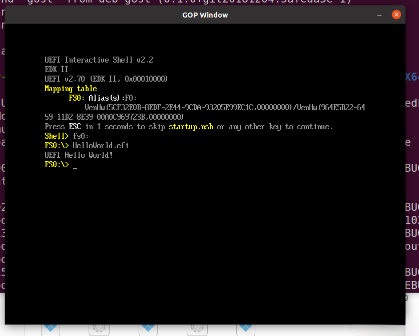

 注1 ：关于更新EDK2 Submodule失败的解决方案

-------------------

直接使用github源更新可能会因为网络太慢导致更新失败，此时可以修改edk2\.gitmodules中的代码源来提高更新速度，如下：

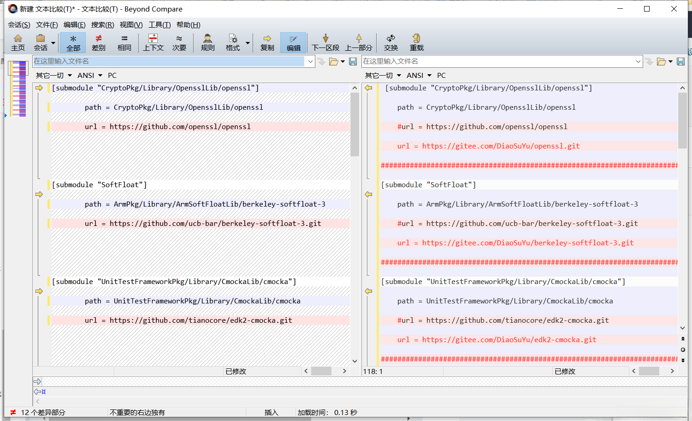

```shell
[submodule "CryptoPkg/Library/OpensslLib/openssl"]
    path = CryptoPkg/Library/OpensslLib/openssl
    #url = <https://github.com/openssl/openssl>
    url = <https://gitee.com/DiaoSuYu/openssl.git>

###################################################################################################

[submodule "SoftFloat"]
    path = ArmPkg/Library/ArmSoftFloatLib/berkeley-softfloat-3
    #url = <https://github.com/ucb-bar/berkeley-softfloat-3.git>
    url = <https://gitee.com/DiaoSuYu/berkeley-softfloat-3.git>

###################################################################################################

[submodule "UnitTestFrameworkPkg/Library/CmockaLib/cmocka"]
    path = UnitTestFrameworkPkg/Library/CmockaLib/cmocka
    #url = <https://github.com/tianocore/edk2-cmocka.git>
    url = <https://gitee.com/DiaoSuYu/edk2-cmocka.git>

###################################################################################################

[submodule "MdeModulePkg/Universal/RegularExpressionDxe/oniguruma"]
    path = MdeModulePkg/Universal/RegularExpressionDxe/oniguruma
    #url = <https://github.com/kkos/oniguruma>
    url = <https://gitee.com/DiaoSuYu/oniguruma.git>

###################################################################################################

[submodule "MdeModulePkg/Library/BrotliCustomDecompressLib/brotli"]
    path = MdeModulePkg/Library/BrotliCustomDecompressLib/brotli
    #url = <https://github.com/google/brotli>
    url = <https://gitee.com/DiaoSuYu/brotli.git>

###################################################################################################

[submodule "BaseTools/Source/C/BrotliCompress/brotli"]
    path = BaseTools/Source/C/BrotliCompress/brotli
    #url = <https://github.com/google/brotli>
    url = <https://gitee.com/DiaoSuYu/brotli.git>
    ignore = untracked

###################################################################################################

[submodule "RedfishPkg/Library/JsonLib/jansson"]
    path = RedfishPkg/Library/JsonLib/jansson
    #url = <https://github.com/akheron/jansson>
    url = <https://gitee.com/DiaoSuYu/jansson.git>

###################################################################################################

[submodule "UnitTestFrameworkPkg/Library/GoogleTestLib/googletest"]
    path = UnitTestFrameworkPkg/Library/GoogleTestLib/googletest
    #url = <https://github.com/google/googletest.git>
    url = <https://gitee.com/DiaoSuYu/googletest.git>

###################################################################################################

[submodule "UnitTestFrameworkPkg/Library/SubhookLib/subhook"]
    path = UnitTestFrameworkPkg/Library/SubhookLib/subhook
    #url = <https://github.com/Zeex/subhook.git>
    url = <https://gitee.com/DiaoSuYu/subhook.git>

###################################################################################################

[submodule "MdePkg/Library/BaseFdtLib/libfdt"]
    path = MdePkg/Library/BaseFdtLib/libfdt
    #url = <https://github.com/devicetree-org/pylibfdt.git>
    url = <https://gitee.com/DiaoSuYu/pylibfdt.git>

###################################################################################################

[submodule "MdePkg/Library/MipiSysTLib/mipisyst"]
    path = MdePkg/Library/MipiSysTLib/mipisyst
    #url = <https://github.com/MIPI-Alliance/public-mipi-sys-t.git>
    url = <https://gitee.com/DiaoSuYu/public-mipi-sys-t.git>

###################################################################################################

[submodule "CryptoPkg/Library/MbedTlsLib/mbedtls"]
    path = CryptoPkg/Library/MbedTlsLib/mbedtls
    #url = <https://github.com/ARMmbed/mbedtls>
    url = <https://gitee.com/DiaoSuYu/mbedtls.git>  

```

可以将需要用的子模块导入gitee，再通过gitee来下载，请注意上面的gitee仓库是我私有的，你们不能直接使用，需要导入到你们自己的gitee仓库，再尝试更新子模块。请尽量保证上方gitee与edk2的下载地址在同一个下载地址，原因是可能会出现在初始化子模块的时候出现clone账户与edk2的clone账户不同的问题。

举一反三，其实整个搭建环境的所有github部分都可以导入到自己的gitee，用于提升下载速度，具体是否需要，自行按需评估。
