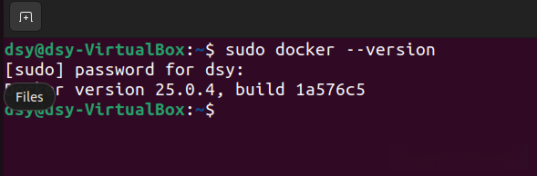
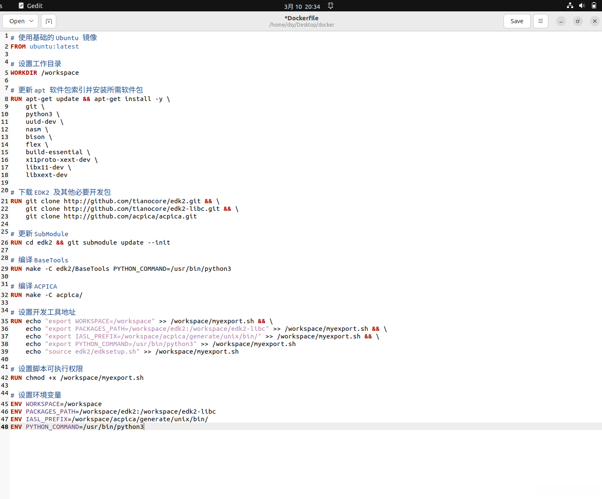
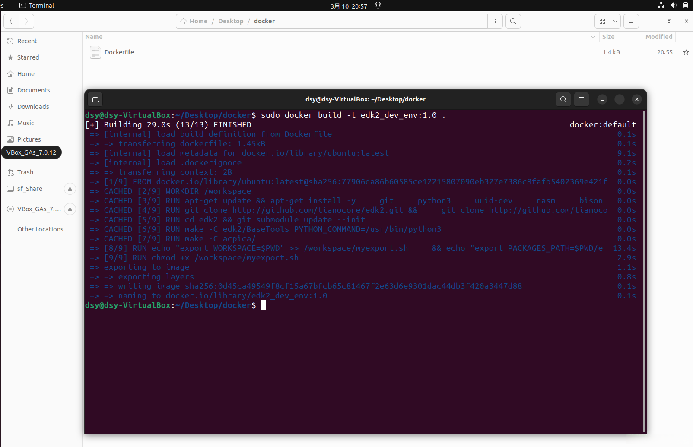
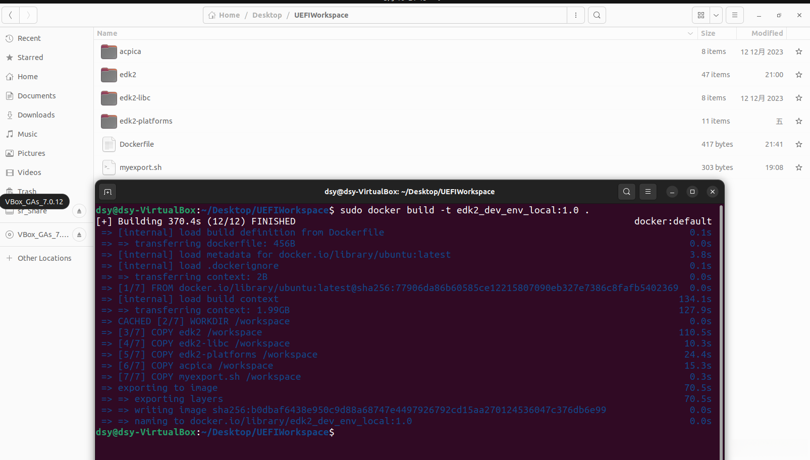
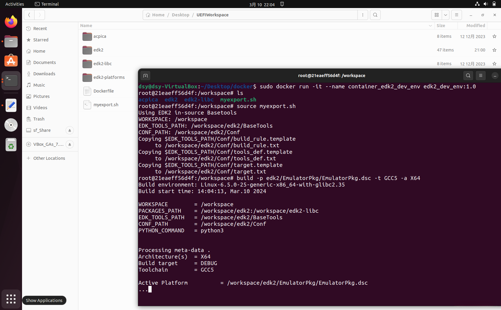
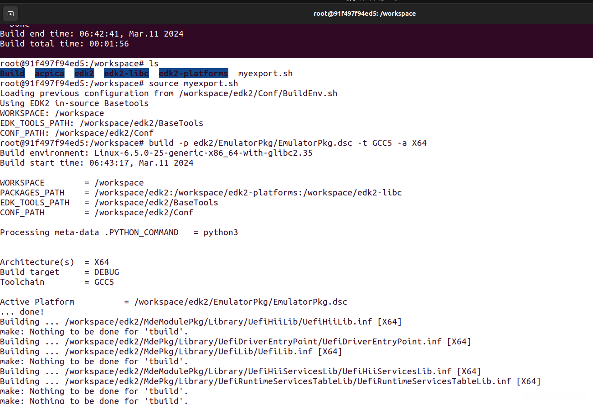

# 【UEFI】使用Docker快速部署EDK2开发环境

 __用于记录怎样在Docker中部署EDK2.__

 > Author: Sam Diao
 > Date: 2024-09-24
 > Rev: 1.0

最近换了OA，重新配置EDK2开发环境让我窒息，因此我决定把整个EDK2的开发环境打包在Docker镜像中，方便在不同设备上快速构建开发环境，也方便后续对开发环境镜像更新。

## 1. Linux下的部署方法

-------------

```shell
主逻辑：
1. 安装Docker，基于Ubuntu 20.04
2. 创建Dockerfile
3. 编译Docker镜像
4. 启动Docker容器
```

### 1.1 安装Docker

#### 1.1.1 卸载旧版本 (如果适用)

如果你之前安装过旧版本的 Docker，首先需要卸载它们。可以使用以下命令来执行卸载：

```shell
sudo apt-get remove docker docker-engine docker.io containerd runc
```

#### 1.1.2 更新 apt 软件包索引

确保你的系统上的 apt 软件包索引是最新的：

```shell
sudo apt-get update
```

#### 1.1.3 安装依赖软件包

Docker 需要一些依赖软件包来正常运行，你可以通过以下命令安装它们：

```shell
sudo apt-get install -y \
apt-transport-https \
ca-certificates \
curl \
gnupg-agent \
software-properties-common
```

#### 1.1.4 添加 Docker 的官方 GPG 密钥

添加 Docker 官方 GPG 密钥以验证下载的 Docker 软件包的完整性：

```shell
curl -fsSL https://download.docker.com/linux/ubuntu/gpg | sudo apt-key add -
```

#### 1.1.5 添加 Docker APT 仓库

添加 Docker APT 仓库以便于从它安装 Docker：

```shell
sudo add-apt-repository \
 "deb \[arch=amd64\] https://download.docker.com/linux/ubuntu\
 $(lsb\_release -cs) \
 stable"
```

#### 1.1.6 更新 apt 软件包索引

再次更新 apt 软件包索引以确保你已经添加的 Docker 仓库已经被包含：

```shell
sudo apt-get update
```

#### 1.1.7 安装 Docker

安装 Docker 软件包：

```shell
sudo apt-get install -y docker-ce docker-ce-cli containerd.io
```

#### 1.1.8 检查安装情况

现在 Docker 已经安装完成。你可以通过运行以下命令来验证 Docker 是否已经正确安装：

```shell
sudo docker --version
```



### 1.2 创建Dockerfile

构建Dockerfile有两种情况，1：拉取github上EDK2的最新source，并直接基于ubuntu20.04进行实时环境搭建并编译镜像；2：直接将本地已搭建好的EDK2的开发环境打包成镜像。我把两种方案都做一遍，但实际工作中只需要任选其一即可，没有优劣，看实际需要决定。

#### 1.2.1 拉取EDK2最新source并编译docker镜像

在ubuntu的桌面上新建名为docker的文件夹并创建Dockerfile：

```shell
mkdir docker
cd docker/
touch Dockerfile
```

开始修改Dockerfile：

```shell
sudo gedit Dockerfile
```

复制下方内容并粘贴到Dockerfile中：

```shell
# 使用基础的 Ubuntu 镜像
FROM ubuntu:latest

# 设置工作目录
WORKDIR /workspace

# 更新 apt 软件包索引并安装所需软件包
RUN apt-get update && apt-get install -y \
git \
python3 \
uuid-dev \
nasm \
bison \
flex \
build-essential \
x11proto-xext-dev \
libx11-dev \
libxext-dev

# 下载 EDK2 及其他必要开发包  
RUN git clone http://github.com/tianocore/edk2.git && \
git clone http://github.com/tianocore/edk2-libc.git && \
git clone http://github.com/acpica/acpica.git

# 更新 SubModule
RUN cd edk2 && git submodule update --init

# 编译 BaseTools
RUN make -C edk2/BaseTools PYTHON\_COMMAND=/usr/bin/python3

# 编译 ACPICA
RUN make -C acpica/

# 设置开发工具地址
RUN echo "export WORKSPACE=\$PWD" >> /workspace/myexport.sh && \
 echo "export PACKAGES\_PATH=\$PWD/edk2:\$PWD/edk2-libc">> /workspace/myexport.sh && \
 echo "export IASL\_PREFIX=/workspace/acpica/generate/unix/bin/" >> /workspace/myexport.sh && \
 echo "export PYTHON\_COMMAND=/usr/bin/python3" >> /workspace/myexport.sh && \
 echo "source edk2/edksetup.sh" >> /workspace/myexport.sh

# 设置脚本可执行权限
RUN chmod +x /workspace/myexport.sh

# 设置环境变量
ENV WORKSPACE=/workspace
ENV PACKAGES\_PATH=/workspace/edk2:/workspace/edk2-libc
ENV IASL\_PREFIX=/workspace/acpica/generate/unix/bin/
ENV PYTHON\_COMMAND=/usr/bin/python3
```



其实这个部分的逻辑就是之前我基于linux手动搭建开发环境的逻辑，只是通过Dockerfile的方式来自动完成，具体可以对比我之前的文章：*__【UEFI】Windows和Linux下的环境搭建__*

#### 1.2.2 打包本地开发环境并编译为镜像文件

我的EDK2开发环境放置在_/home/dsy/Desktop/UEFIWorkspace/_下，在这个文件夹下创建Dockerfile：

```shell
touch Dockerfile
```

开始修改Dockerfile：

```shell
sudo gedit Dockerfile
```

复制下方内容并粘贴到Dockerfile中：

```shell
# 使用基础的 Ubuntu 镜像
FROM ubuntu:latest

# 设置工作目录
WORKDIR /workspace

# 更新 apt 软件包索引并安装所需软件包  
RUN apt-get update && apt-get install -y \
git \
python3 \
uuid-dev \
nasm \
bison \
flex \
build-essential \
x11proto-xext-dev \
libx11-dev \
libxext-dev

# 将所需要的文件夹下的所有文件拷贝到容器的 /workspace 目录下  
COPY edk2 /workspace/edk2
COPY edk2-libc /workspace/edk2-libc
COPY edk2-platforms /workspace/edk2-platforms
COPY acpica /workspace/acpica
COPY myexport.sh /workspace

# 将当前文件夹下所有文件和文件夹都拷贝到容器的 /workspace 目录下  
# COPY . /workspace
```


需要明确，我的EDK2开发环境是放置在 /home/dsy/Desktop/UEFIWorkspace/ 下的，你们要确认自己的环境位置再针对修改上方路径。

### 1.3 编译Docker镜像

同样，我把刚刚1.2中的两种不同情况也分开编译。

#### 1.3.1 拉取EDK2的最新source并编译为镜像文件

拉取EDK2的github source并编译为Docker镜像，命名为edk2\_dev\_env，版本号为1.0，前方的镜像命名必须为小写，缩写含义为(EDK2\_Development\_Environment)：

```shell
sudo docker build -t edk2\_dev\_env:1.0 .
```



#### 1.3.2 打包本地开发环境并编译为镜像文件

直接在_/home/dsy/Desktop/UEFIWorkspace/_，开始编译Docker镜像，命名为edk2\_dev\_env\_local，版本号为1.0，前方的镜像命名必须为小写，缩写含义为(EDK2\_Development\_Environment\_Local)：

```shell
sudo docker build -t edk2\_dev\_env\_local:1.0 .
```



### 1.4 启动Docker容器

#### 1.4.1 启动1.3.1中生成的edk2\_dev\_env:1.0镜像

```shell
> sudo docker run -it --name container\_edk2\_dev\_env edk2\_dev\_env:1.0
```

 接下来就可以正常执行uefi代码编译和开发了。



#### 1.4.2 启动1.3.2中生成的edk2\_dev\_env\_local:1.0镜像

```shell
sudo docker run -it --name container\_edk2\_dev\_env\_local edk2\_dev\_env\_local:1.0
```



## 2. 常用命令

-------------

```shell
sudo docker ps -a                                   #显示所有正在运行和已停止的 Docker 容器的列表
sudo docker rm container\_name/id                   #删除容器(提供名称或ID)
sudo docker restart container\_name/id              #重新启动容器(提供名称或ID)
sudo docker exec -it container\_name/id /bin/bash   #以命令行的形式执行容器
sudo docker images                                  #显示所有Docker镜像的列表
sudo docker rmi image\_name/id                      #删除镜像(提供名称或ID)
```
