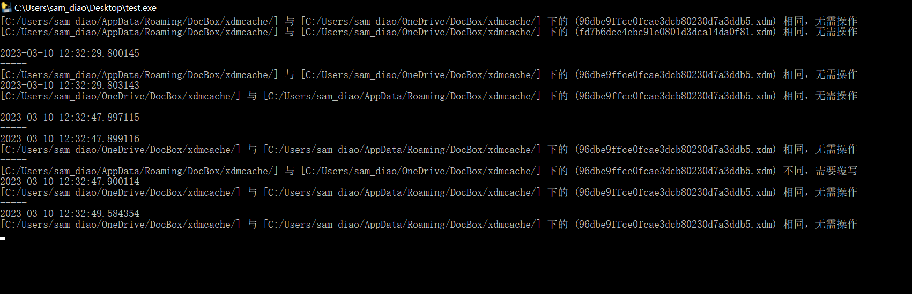

# 【脚本】利用OneDriver实时同步零碎文件

 > Author: Sam Diao
 > Date: 2024-09-24
 > Rev: 1.0

最近在写论文，阅读了大量的文献，在这期间利用稻壳阅读器(DocBox)在阅读的同时也做了一些笔记，可恨是在登录稻壳阅读器后，对于这些圈圈画画的笔记进行异地同步居然还要付费，因此再想办法怎么既可以达成同步的需求，又可以免费白嫖呢？

于是，一个同步文件的脚本就是我需要的了，主逻辑就是找到DocBox中关然后于笔记文件的存放点，然后实时监测这些笔记的生成和更新，如果有发现这种行为的发生，就把有变动的文件同步到OneDriver，同样的，如果发现OneDriver上有更新的变动文件，也会同步到DocBox中(同步前会判断云端和本地的文件是否有差异，以避免错误覆盖)。同理，在异地使用DocBox时，也运行这个脚本就可以了，这就节省了大量的实际去同步这些零碎的问题。

拓展开来，可以利用这种方式实时同步所有需要的文件，而无需人为手动干预。

源代码：

```python
import os
import time
import shutil
import filecmp
import datetime
from watchdog.observers import Observer
from watchdog.events import FileSystemEventHandler
 
 
def FileCopy(FilePath):
    filename = FilePath.split('/')[-1]
    original = FilePath.replace(filename, '')
 
    if original == path1:
        destination = path2
    else:
        destination = path1
 
    if os.path.exists(destination + filename):
        if filecmp.cmp(FilePath, destination + filename):
            print("[" + original + "] 与 [" + destination + "] 下的 (" + filename + ") 相同，无需操作")
        else:
            shutil.copy(FilePath, destination)
            print("[" + original + "] 与 [" + destination + "] 下的 (" + filename + ") 不同，需要覆写")
    else:
        shutil.copy(FilePath, destination)
        print("[" + original + "] 下新建了 (" + filename + ") ，已同步复制到 [" + destination + "]")
 
 
def FileRemove(FilePath):
    filename = FilePath.split('/')[-1]
    original = FilePath.replace(filename, '')
 
    if original == path1:
        destination = path2
    else:
        destination = path1
 
    if os.path.exists(destination + filename):
        os.remove(destination + filename)
        print(
            "已删除 [" + original + "] 下的 (" + filename + ") ，同步删除 [" + destination + "] 下的 (" + filename + ")")
    else:
        print(
            "已删除 [" + original + "] 下的 (" + filename + ") ，但 [" + destination + "] 下无 (" + filename + ")，因此无需操作")
 
 
class MyEventHandler(FileSystemEventHandler):
 
    def __init__(self):
        FileSystemEventHandler.__init__(self)
 
    def on_any_event(self, event):
 
        print("-----")
        print(datetime.datetime.now().strftime('%Y-%m-%d %H:%M:%S.%f'))
 
    # 移动
    def on_moved(self, event):
 
        if event.is_directory:
            print("目录 moved:{src_path} -> {dest_path}".format(src_path=event.src_path, dest_path=event.dest_path))
        else:
            print("文件 moved:{src_path} -> {dest_path}".format(src_path=event.src_path, dest_path=event.dest_path))
 
    # 新建
    def on_created(self, event):
 
        """
        if event.is_directory:
            print("目录 created:{file_path}".format(file_path=event.src_path))
        else:
            print("文件 created:{file_path}".format(file_path=event.src_path))
        """
        FileCopy(event.src_path)
 
    # 删除
    def on_deleted(self, event):
 
        """
        if event.is_directory:
            print("目录 deleted:{file_path}".format(file_path=event.src_path))
        else:
            print("文件 deleted:{file_path}".format(file_path=event.src_path))
        """
        FileRemove(event.src_path)
 
    # 修改
    def on_modified(self, event):
 
        """
        if event.is_directory:
            print("目录 modified:{file_path}".format(file_path=event.src_path))
        else:
            print("文件 modified:{file_path}".format(file_path=event.src_path))
        """
        FileCopy(event.src_path)
 
 
if __name__ == '__main__':
 
    path1 = "C:/Users/sam_diao/AppData/Roaming/DocBox/xdmcache/"
    path2 = "C:/Users/sam_diao/OneDrive/DocBox/xdmcache/"
 
    files = os.listdir(path2)
    for i in range(0, len(files)):
        if os.path.exists(path1 + files[i]):
            if filecmp.cmp(path2 + files[i], path1 + files[i]):
                print("[" + path1 + "] 与 [" + path2 + "] 下的 (" + files[i] + ") 相同，无需操作")
            else:
                shutil.copy(path2 + files[i], path1)
                print("[" + path1 + "] 与 [" + path2 + "] 下的 (" + files[i] + ") 不同，需要覆写")
        else:
            shutil.copy(path2 + files[i], path1)
            print(
                "[" + path2 + "] 下新增 (" + files[i] + ") 而 [" + path1 + "] 下无 (" + files[i] + ") 因此，需要复制 (" +
                files[i] + ") 到 [" + path1 + "]")
 
    myEventHandler = MyEventHandler()
 
    # 观察者
    observer1 = Observer()
    observer2 = Observer()
 
    # recursive:True 递归的检测文件夹下所有文件变化。
    observer1.schedule(myEventHandler, path1, recursive=True)
    observer2.schedule(myEventHandler, path2, recursive=True)
 
    # 观察线程，非阻塞式的。
    observer1.start()
    observer2.start()
 
    try:
        while True:
            time.sleep(1)
    except KeyboardInterrupt:
        observer1.stop()
        observer2.stop()
 
    observer1.join()
    observer2.join()
```

实际过程：
每次开机时设置脚本自动运行，脚本会在最开始的时候开始同步云端和本地文件，之后会一直静默监听，如果有发生变化的文件，会实时进行操作同步，用于保证整个工作期间，无需人员的干预。


