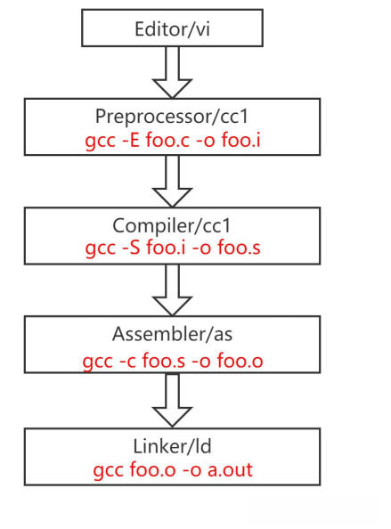
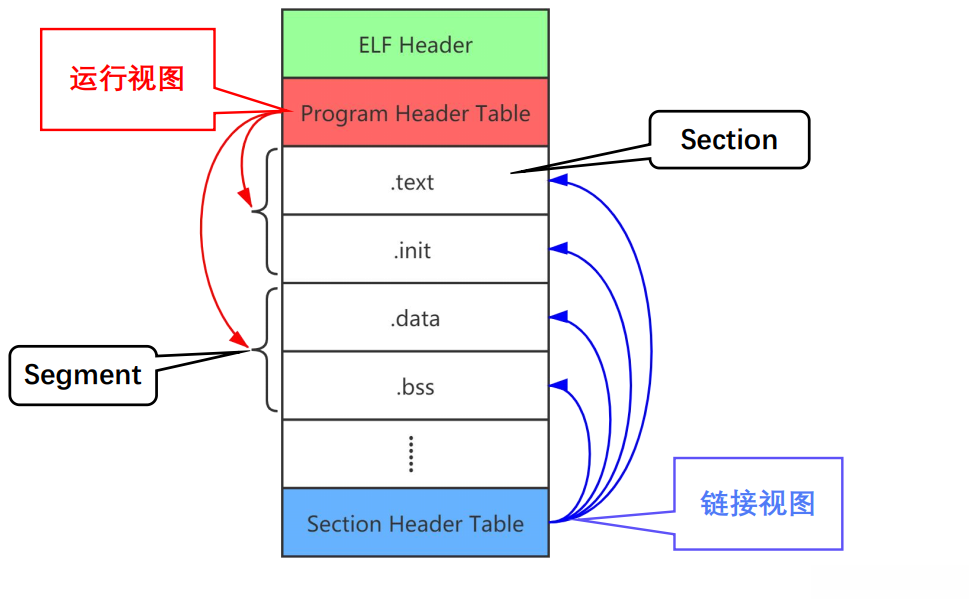
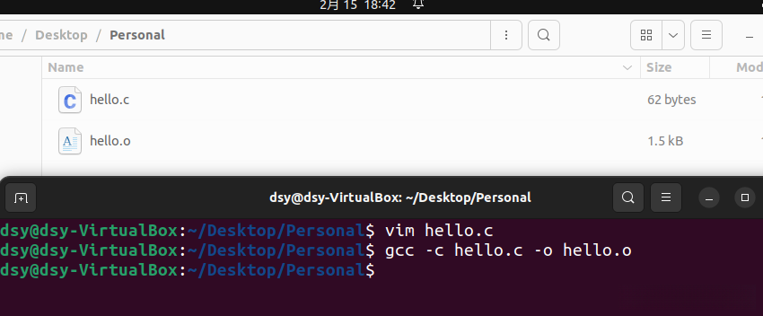
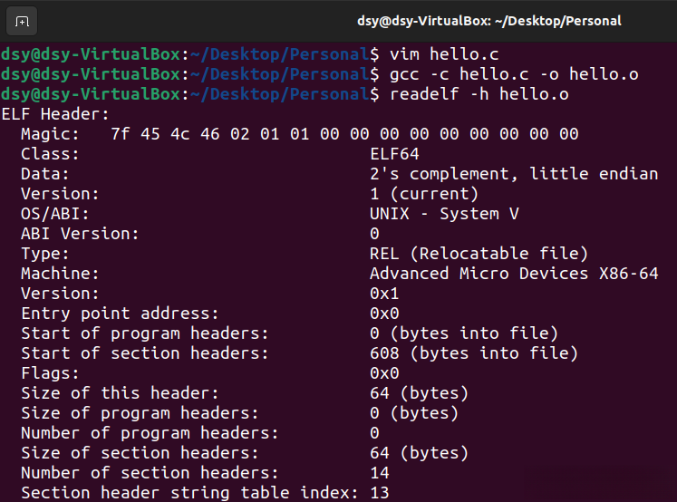
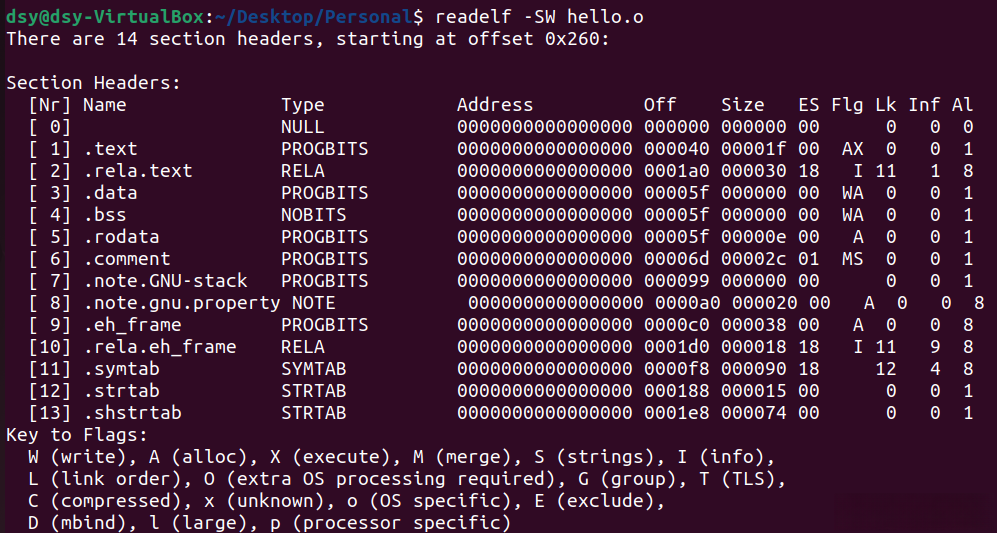
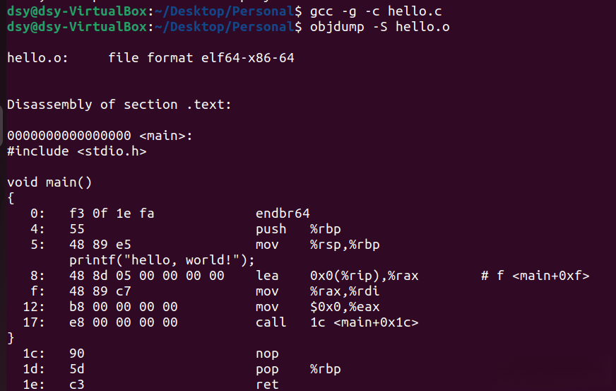
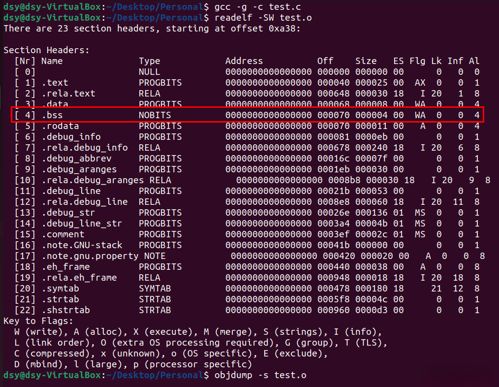
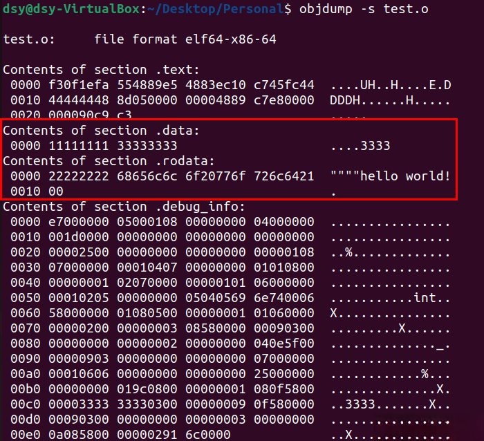
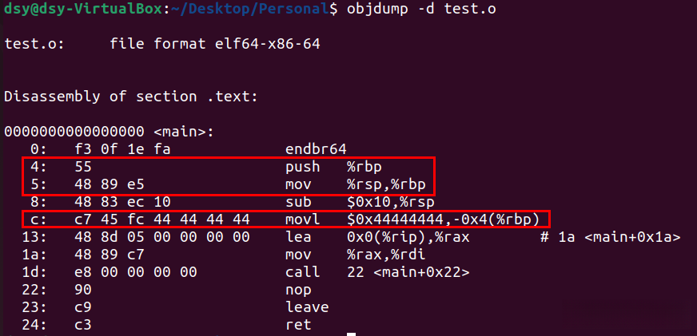

# 关于编译、汇编和链接

> Author: Sam Diao
> Date: 2024-09-24
> Rev

## 1. GCC的命令格式

-------------------------------------------------------------------------

``` shell
gcc [options] [filenames]
```

| 序号       | 选项       | 含义 |
|:----------:|:----------:|:----------|
| 1          | -E         | 只做预处理                                      |
| 2          | -c         | 只做编译，不进行链接，目的是为了生成目标文件‘.o’  |
| 3          | -S         | 生成汇编代码                                    |
| 4          | -o file    | 将输出生成的内容保存至file描述的的文件中          |
| 5          | -g         | 在输出文件中加入支持调试的信息                   |
| 6          | -v         | 显示输出详细的命令执行过程信息                   |

## 2. GCC的执行步骤

-------------------------------------------------------------------------



1、编译(cc1,cc1是C语言的编译器：编译器完成“预处理”和“编译”，“预处理”主要指的是处理源文件中以“#”开头的预处理指令，比如#include、#define等；“编译”则针对预处理的结果进行一系列的词法分析、语法分析、语义分析，优化后生成汇编指令，存放在.o为后缀的目标文件中。

2、汇编(as)：汇编器将汇编语言代码转换为CPU可以执行的指令。

3、链接(ld)：链接器将汇编器生成的目标文件和一些标准库(比如libc)文件组合，形成最终可执行的应用程序。

## 3. ELF文件格式

-------------------------------------------------------------------------

[ELF文件格式简介](https://blog.csdn.net/GrayOnDream/article/details/124564129)

[Linux- 浅谈ELF目标文件格式](https://blog.csdn.net/weixin_43844521/article/details/129811818)



## 练习1

1、编写⼀个简单的打印 “hello, world!” 的程序源文件: hello.c

```shell
vim hello.c
```

2、对源文件进⾏本地编译，⽣成针对⽀持x86\_64指令集架构处理器的⽬标文件hello.o

```shell
gcc -c hello.c -o hello.o
```

其中-o hello.o可以省略，不指定输出文件名的话，会默认生成同名的hello.o



3、查看hello.o的文件的文件头信息

```shell
readelf -h hello.o
```



4、查看hello.o的Section header table

```shell
readelf -SW hello.o
```



5、对hello.o反汇编，并查看hello.c的C程序源码和机器指令的对应关系

```shell
gcc -g -c hello.c
objdump -S hello.o
```



## 练习2

```C
#include <stdio.h>
    int global_init = 0x11111111;
    const int global_const = 0x22222222;
void main()
{
    static int static_var = 0x33333333;
    static int static_var_uninit;
    int auto_var = 0x44444444;
    printf("hello world!\n");
    return;
}
```

请问编译为.o文件后，**global\_init**, **global\_const**, **static\_var**, **static\_var\_uninit**, **auto\_var**这些变量分别存放在那些section⾥，**"hello world!\\n"**这个字符串⼜在哪⾥？

**global\_init**：存放在.data中。由于它被初始化了，所以会存放在.data中。
**global\_const**：存放在.rodata中，因为它是一个常量，不可修改。  
**static\_var**：存放在.data中。由于它是一个静态变量且被初始化了，所以会存放在.data中。  
**static\_var\_uninit**：存放在.bss中，因为它是一个静态变量但未被初始化，.bss存放未初始化的全局和静态变量。
**auto\_var**：在函数内部声明的局部变量通常存放在栈上，而不是.o文件中的sections中。
**"hello world!\\n"**：存放在.rodata中，因为它是一个常量字符串，不可修改。

**验证：**

```shell
> gcc -g -c test.c
> objdump -S test.o
> objdump -s test.o
```







如上所示：  
int **global\_init** \= 0x11111111，static int **static\_var** \= 0x33333333，存放在.data中。  
const int **global\_const** \= 0x22222222，**"hello world!\\n"**，存放在.rodata中。  
static int **static\_var\_uninit**，未被初始化，但int类型的变量通常占用4个字节，因此可以合理确认存放在.bss中。  
int **auto\_var** \= 0x44444444，存放在堆栈上，可以看到被放置在rbp指向的地址。
