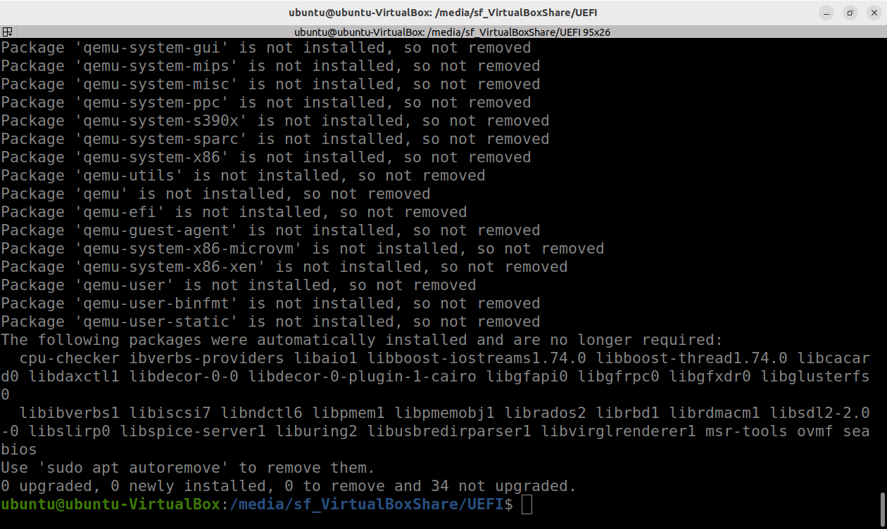
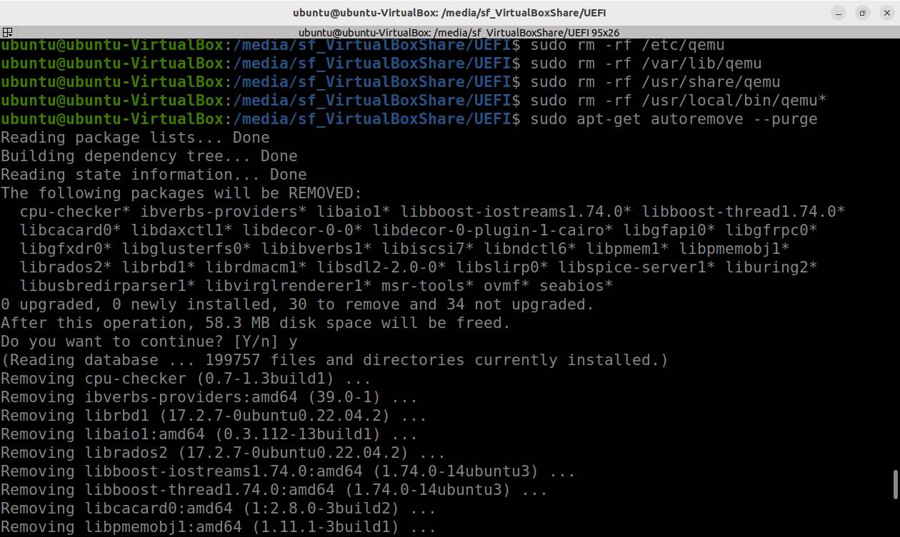
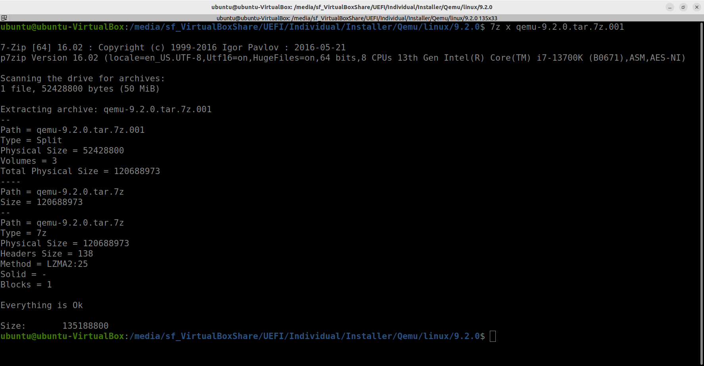
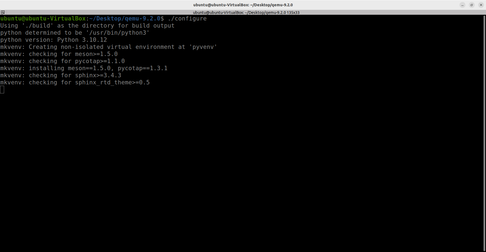
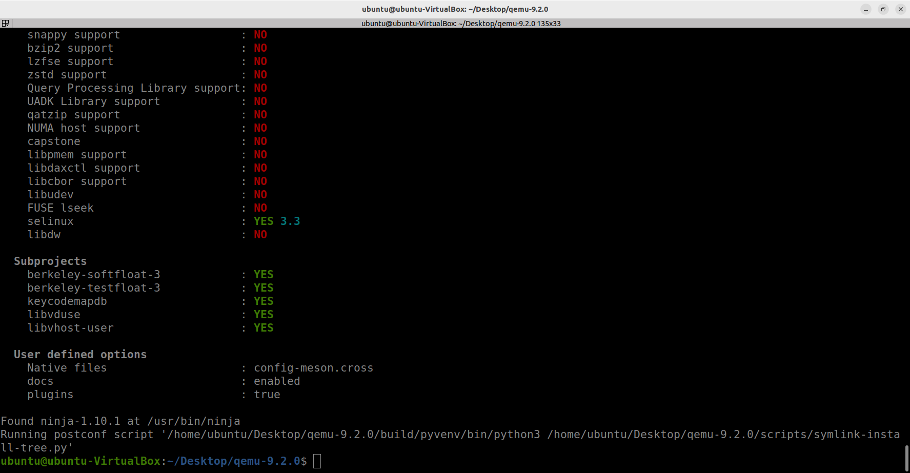

# Installing QEMU from Source in Ubuntu

This document records the steps to install QEMU from the source code. The example uses QEMU 9.2.0.

---

## 1. List All QEMU-related Packages

First, ensure that any existing QEMU installation is removed. You can list all QEMU-related packages to verify they have been uninstalled:

```bash
dpkg -l | grep qemu
```


## 2. Force Remove All QEMU-related Packages

Use the following command to forcefully remove all QEMU-related packages from your system:

```bash
sudo dpkg --remove --force-remove-reinstreq $(dpkg -l | grep qemu | awk '{print $2}')
sudo apt remove --purge qemu* ipxe-qemu*
```




## 3. Delete QEMU Configuration Files and Data

Manually delete QEMU's configuration files and data directories to ensure that no leftover files remain:

```bash
sudo rm -rf /etc/qemu
sudo rm -rf /var/lib/qemu
sudo rm -rf /usr/share/qemu
sudo rm -rf /usr/local/bin/qemu*
```


## 4. Clean the System

Remove any leftover dependencies and unnecessary packages:

```bash
sudo apt-get autoremove --purge
```



## 5. Install QEMU from Source

Before beginning the installation, ensure you have the necessary utilities. First, install the `p7zip-full` package to extract QEMU source files:

```bash
sudo apt-get update
sudo apt install p7zip-full
sudo apt install libsdl2-dev libgtk-3-dev # For Qemu display mode: sdl and gtk
```

### 5.1.  Get Qemu source code

#### Option 1: Download from the Official Website

You can directly download the QEMU source code archive from the official QEMU website:

```bash
wget https://download.qemu.org/qemu-9.2.0.tar.xz
```



#### Option 2: Extract Locally from a Folder

If you already have the QEMU source archive locally, navigate to the folder where the source code is stored and extract it using `7z`:

```bash
cd /path/to/QEMU/source
7z x qemu-9.2.0.tar.7z.001
```


### 5.2. Build and Install QEMU

After extracting the source code, navigate to the QEMU directory and run the following commands to configure, build, and install QEMU:

```bash
tar xvJf qemu-9.2.0.tar.xz
cd qemu-9.2.0
./configure
make
sudo make install
```





## 6. Verify QEMU Version

If the installation was successful, you can verify the QEMU version by running the following command:

```bash
qemu-system-x86_64 --version
```


