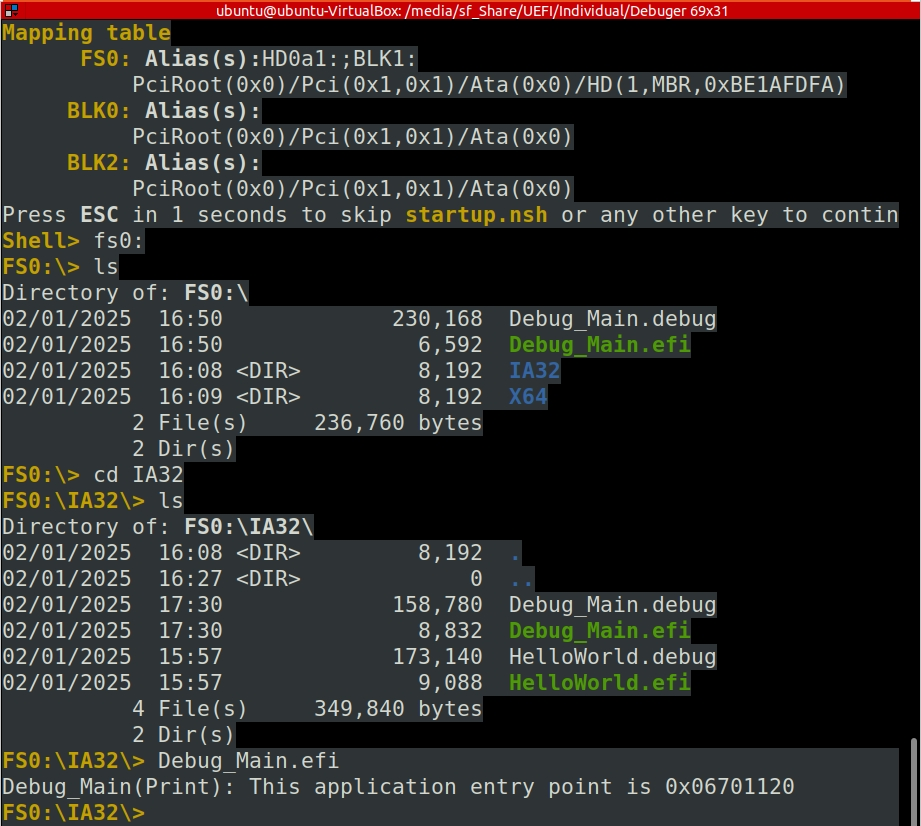
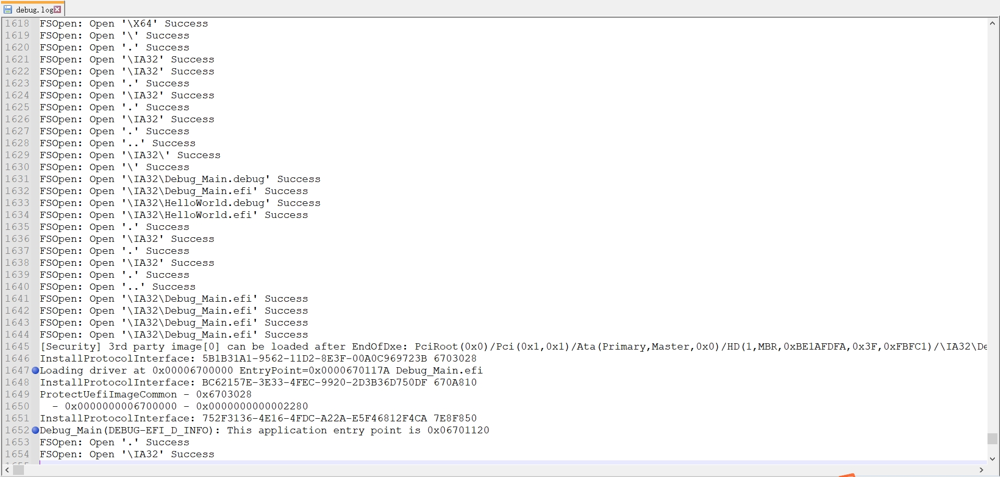
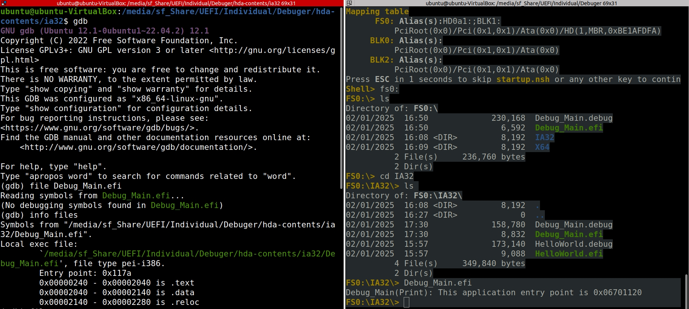
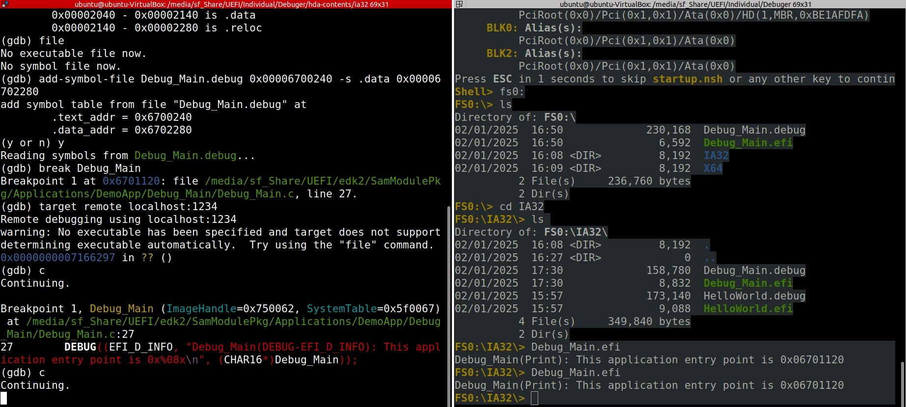
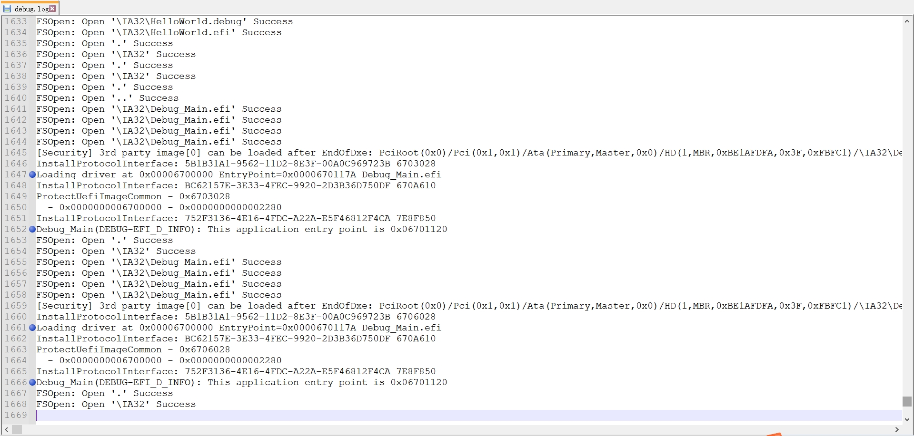
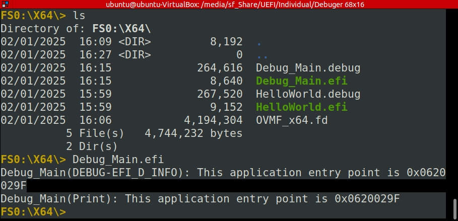

# How to Dump Debug Log and Debug with GDB on OVMF

This guide explains how to dump debug logs when debugging on OVMF (Open Virtual Machine Firmware). It covers adding a debug application to OVMF, building the firmware, running QEMU, and using GDB for debugging.

---

## 1. Add `Debug_Main.inf` to OVMF

To include the `Debug_Main` application in OVMF, add the following line to the `[Components]` section of either `edk2/OvmfPkg/OvmfPkgIa32.dsc` or `edk2/OvmfPkg/OvmfPkgX64.dsc`:

```ini
[Components]
  SamModulePkg/Applications/DemoApp/Debug_Main/Debug_Main.inf
```

---

## 2. Build OVMF

Run one of the following commands to build OVMF with the `Debug_Main` application:

- For **X64** architecture:

  ```bash
  build -p OvmfPkg/OvmfPkgX64.dsc -t GCC5 -a X64 -b DEBUG
  ```

- For **IA32** architecture:

  ```bash
  build -p OvmfPkg/OvmfPkgIa32.dsc -t GCC5 -a IA32 -b DEBUG
  ```

After building, copy the generated `Debug_Main.efi` and `Debug_Main.debug` files to either `disk.img` or the `hda-contents` folder.

---

## 3. Run QEMU

### Option 1: Using `disk.img`

Run the following command to start QEMU with a USB storage device:

```bash
qemu-system-x86_64 \
    -drive if=pflash,format=raw,file=OVMF.fd,id=BIOS-OVMF \
    -drive if=none,format=raw,file=disk.img,id=usb-drive \
    -device usb-ehci,id=usb-ehci \
    -device usb-storage,drive=usb-drive,bus=usb-ehci.0 \
    -debugcon file:debug.log \
    -global isa-debugcon.iobase=0x402 \
    -nographic \
    -net none \
    -s
```

### Option 2: Using `hda-contents`

Run the following command to start QEMU with an IDE storage device:

```bash
qemu-system-x86_64 \
    -drive if=pflash,format=raw,file=OVMF.fd,id=BIOS-OVMF \
    -drive file=fat:rw:hda-contents,format=raw,if=ide,index=0 \
    -debugcon file:debug.log \
    -global isa-debugcon.iobase=0x402 \
    -nographic \
    -net none \
    -s
```

---

## 4. Run `Debug_Main.efi`

After starting QEMU, run the `Debug_Main.efi` application. If everything works correctly, you should see output similar to the following:




---

## 5. Debug with GDB

In `debug.log`, after executing `Debug_Main.efi`, the driver is loaded at address `0x00006700000`:

```bash
line 1647: Loading driver at 0x00006700000 EntryPoint=0x0000670117A Debug_Main.efi
```

After running QEMU with the `-s` option, GDB can be used for debugging.

### **5.1 Start GDB and Load Symbols**

Run GDB in the folder where you set the `Debug_Main.efi`:

```bash
ubuntu@ubuntu-VirtualBox:/media/sf_Share/UEFI/Individual/Debuger/hda-contents/ia32$ gdb
```

Within GDB:

```gdb
(gdb) file Debug_Main.efi
Reading symbols from Debug_Main.efi...
(No debugging symbols found in Debug_Main.efi)
```

Verify that the symbols are loaded:

```gdb
(gdb) info files
Symbols from "/media/sf_Share/UEFI/Individual/Debuger/hda-contents/ia32/Debug_Main.efi".
Local exec file:
 `/media/sf_Share/UEFI/Individual/Debuger/hda-contents/ia32/Debug_Main.efi', file type pei-i386.
 Entry point: 0x117a
 0x00000240 - 0x00002040 is .text
 0x00002040 - 0x00002140 is .data
 0x00002140 - 0x00002280 is .reloc
```



### **5.2 Calculate the Address Offsets**

Use the previously obtained load address from `debug.log` and add the section offsets:

- **Text section**: `0x00006700000 + 0x0240 = 0x00006700240`
- **Data section**: `0x00006700240 + 0x2040 = 0x00006702280`

### **5.3 Unload `Debug_Main.efi`**

To ensure a clean state before reloading the symbol file, use the following GDB command:

```gdb
(gdb) file
No executable file now.
No symbol file now.
```

### **5.4 Load Debug Symbols**

After unloading the previous executable, load the symbol file for `Debug_Main`:

```gdb
(gdb) add-symbol-file Debug_Main.debug 0x00006700240 -s .data 0x00006702280
add symbol table from file "Debug_Main.debug" at
 .text_addr = 0x6700240
 .data_addr = 0x6702280
(y or n) y
Reading symbols from Debug_Main.debug...
```

This command tells GDB to load the debug symbols from `Debug_Main.debug`, and the offsets for the `.text` and `.data` sections are provided.

### **5.5 Set Breakpoint**

Once the symbol file is loaded, set a breakpoint at the entry point of `Debug_Main`:

```gdb
(gdb) break Debug_Main
Breakpoint 1 at 0x6701120: file /media/sf_Share/UEFI/edk2/SamModulePkg/Applications/DemoApp/Debug_Main/Debug_Main.c, line 27.
```

### **5.6 Attach GDB to QEMU**

To begin remote debugging, use the following command to connect GDB to QEMU:

```gdb
(gdb) target remote localhost:1234
Remote debugging using localhost:1234
warning: No executable has been specified and target does not support
determining executable automatically.  Try using the "file" command.
0x0000000007166297 in ?? ()
(gdb) c
Continuing.
```

GDB will connect to QEMU, and execution will continue until the breakpoint is hit.

### **5.7 Restart `Debug_Main.efi` from the UEFI Shell**

At this point, everything is set up. Go back to the UEFI Shell, and run `Debug_Main.efi` again. See the breakpoint hit in the code, and continue debugging.

After the breakpoint is hit, type `c` (for continue) to let the program run. See debug output both in the UEFI Shell and in the `debug.log`.




The `debug.log` will now also contain new log entries corresponding to the actions performed in `Debug_Main.efi`:



---

## 6. Notes

- Ensure that `OVMF.fd`, `disk.img`, or `hda-contents` are correctly configured and accessible.
- The `debug.log` file will contain debug output from QEMU and can be used for troubleshooting.
- If you encounter issues, verify that the `Debug_Main.efi` application is correctly built and copied to the appropriate location.
- Use `objdump -x Debug_Main.efi` to inspect symbol information.

---

## Appendix: Print Debug Information to UEFI Shell

To print debug information directly to the UEFI Shell, modify the `dsc` file as follows:

```ini
[Components]
  SamModulePkg/Applications/DemoApp/Debug_Main/Debug_Main.inf {
    <LibraryClasses>
      DebugLib|MdePkg/Library/UefiDebugLibConOut/UefiDebugLibConOut.inf
  }
```

This change redirects debug output to the UEFI Shell console, like this:


---

This update moves the "Print Debug Information to UEFI Shell" section into an appendix and retains the clarity of the remaining guide for debugging OVMF with GDB.
