# How to Use Intel UDK Debugger on Linux for Debugging OVMF and UEFI Applications

This guide provides step-by-step instructions on how to use the **Intel UDK Debugger** on Linux to debug OVMF (Open Virtual Machine Firmware) and UEFI applications. It covers setting up the environment, building OVMF with debugging support, and using GDB with Intel UDK Debugger for source-level debugging.

---

## 1. Check GDB and Install Intel UDK Debugger

Before starting, ensure that your GDB supports `--with-expat`. If not, upgrade GDB to a compatible version.

Run the following command to check GDB configuration:

```bash
gdb -configuration
```

Example output:

```plaintext
This GDB was configured as follows:
   configure --host=x86_64-linux-gnu --target=x86_64-linux-gnu
      --with-auto-load-dir=$debugdir:$datadir/auto-load
      --with-auto-load-safe-path=$debugdir:$datadir/auto-load
      --with-expat
      --with-gdb-datadir=/usr/share/gdb (relocatable)
      --with-jit-reader-dir=/usr/lib/gdb (relocatable)
      --without-libunwind-ia64
      --with-lzma
      --with-babeltrace
      --with-intel-pt
      --with-mpfr
      --with-xxhash
      --with-python=/usr (relocatable)
      --with-python-libdir=/usr/lib (relocatable)
      --with-debuginfod
      --without-guile
      --enable-source-highlight
      --with-separate-debug-dir=/usr/lib/Debug (relocatable)
      --with-system-gdbinit=/etc/gdb/gdbinit
      --with-system-gdbinit-dir=/etc/gdb/gdbinit.d
```

If `--with-expat` is present, proceed to install the Intel UDK Debugger.

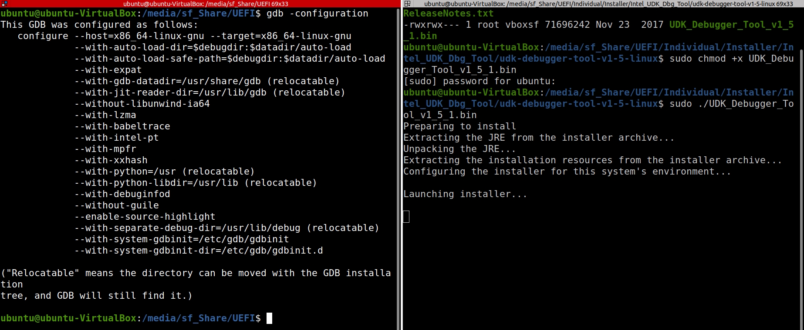

### Install Intel UDK Debugger

1. Make the installer executable:

   ```bash
   sudo chmod +x UDK_Debugger_Tool_v1_5_1.bin
   ```

2. Run the installer:

   ```bash
   sudo ./UDK_Debugger_Tool_v1_5_1.bin
   ```

Follow the installation prompts as shown in the screenshots below:

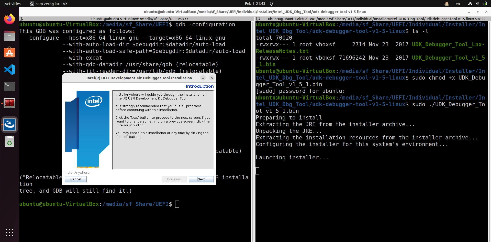
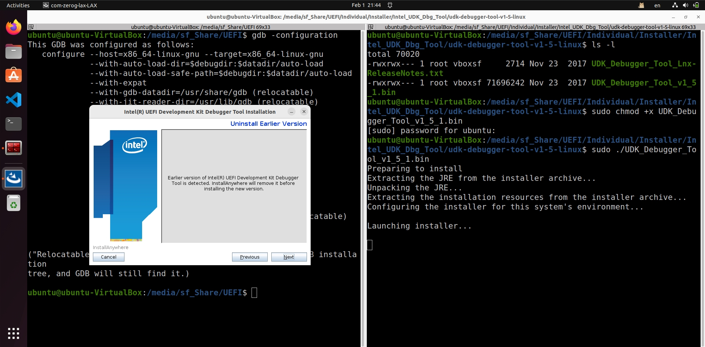
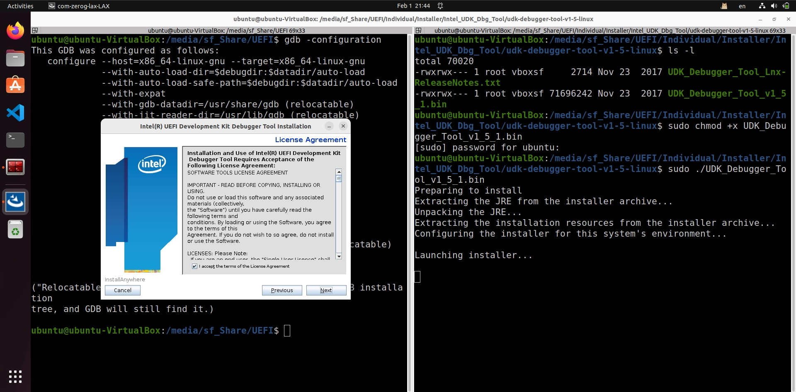
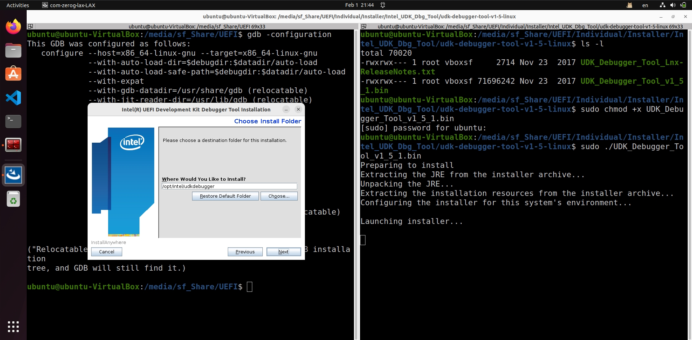


---

## 2. Add `CpuBreakpoint()` to the Source Code

To enable debugging, insert a CPU breakpoint in the UEFI application's source code. For example, in `DebugMain.c`:

```c
// Insert a CPU breakpoint for debugging. This will cause the debugger to break execution at this point.
CpuBreakpoint ();
```

---

## 3. Build OVMF and Debug_Main.efi

To include the `Debug_Main` application in OVMF, modify the `edk2/OvmfPkg/OvmfPkgX64.dsc` file as follows:

### Modify `OvmfPkgX64.dsc`

Add the following lines to the `[Components]` section:

```ini
[Components]
  SamModulePkg/Applications/DemoApp/Debug_Main/Debug_Main.inf
```

Enable source-level debugging by adding:

```ini
DEFINE SOURCE_DEBUG_ENABLE = TRUE
```

Move the `PcdFSBClock` setting from `[PcdsDynamicDefault]` to `[PcdsFixedAtBuild]`:

```ini
[PcdsFixedAtBuild]
  gEfiMdePkgTokenSpaceGuid.PcdFSBClock|1000000000
```

### Build OVMF

Run the following command to build OVMF with debugging support:

```bash
build -p OvmfPkg/OvmfPkgX64.dsc -t GCC5 -a X64 -b NOOPT -DSOURCE_DEBUG_ENABLE=TRUE -DDEBUG_ON_SERIAL_PORT=TRUE
```

After building, copy the generated `Debug_Main.efi` and `Debug_Main.debug` files to the `hda-contents` folder.

---

## 4. Integrate Debugging with QEMU and Intel UDK Debugger

### 1) Create Pipes for Communication

Create named pipes for communication between QEMU and Intel UDK Debugger:

```bash
mkfifo /tmp/serial.in
mkfifo /tmp/serial.out
```

### 2) Start Intel UDK Debugger

Run the following command to start the Intel UDK Debugger:

```bash
sudo /opt/intel/udkdebugger/bin/udk-gdb-server
```

### 3) Start GDB

Open a new terminal and start GDB:

```bash
gdb
```

### 4) Start QEMU

Run QEMU with the following command:

```bash
qemu-system-x86_64 \
    -drive if=pflash,format=raw,file=OVMF.fd,id=BIOS-OVMF \
    -drive file=fat:rw:hda-contents,format=raw,if=ide,index=0 \
    -net none \
    -serial pipe:/tmp/serial
```

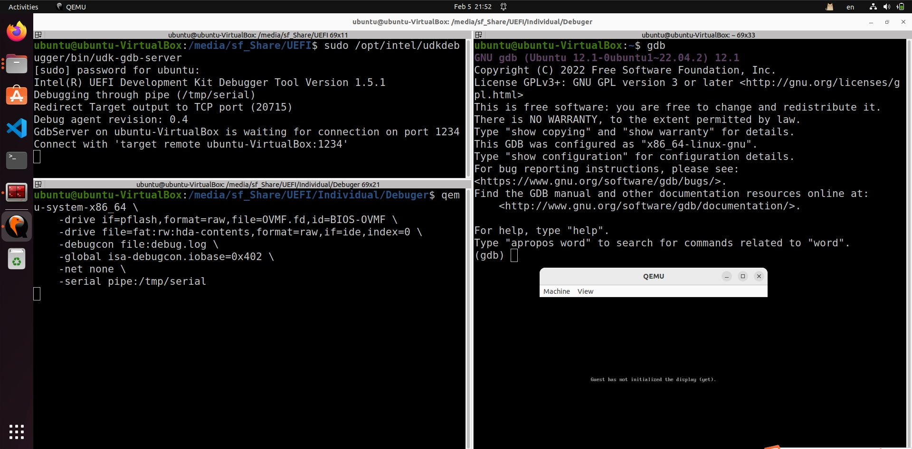

---

## 5. Debugging with GDB and Intel UDK Debugger

### 1) Connect GDB to Intel UDK Debugger

When QEMU starts, it will pause execution. In the GDB terminal, connect to the Intel UDK Debugger:

```bash
(gdb) target remote ubuntu-VirtualBox:1234
```

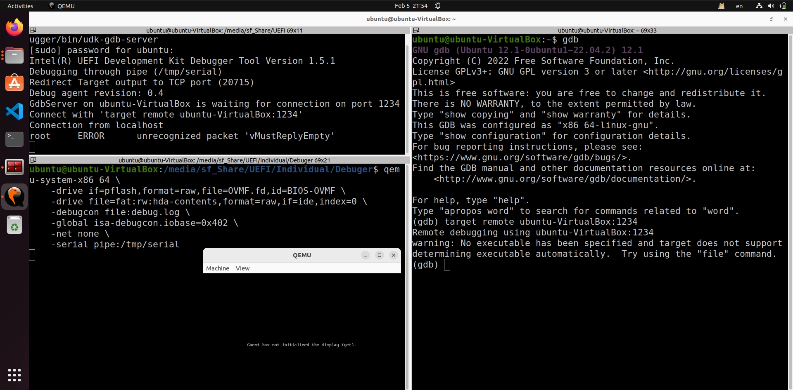

### 2) Continue to boot

Continue to boot the QEMU into UEFI Shell

```bash
(gdb) c
```


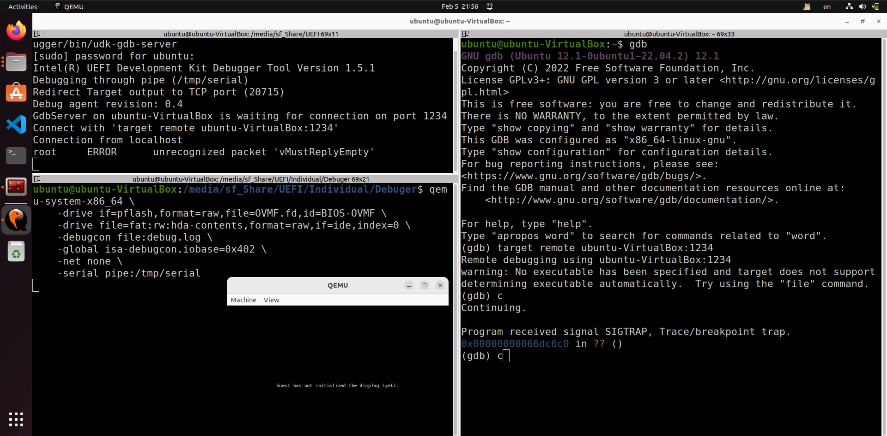
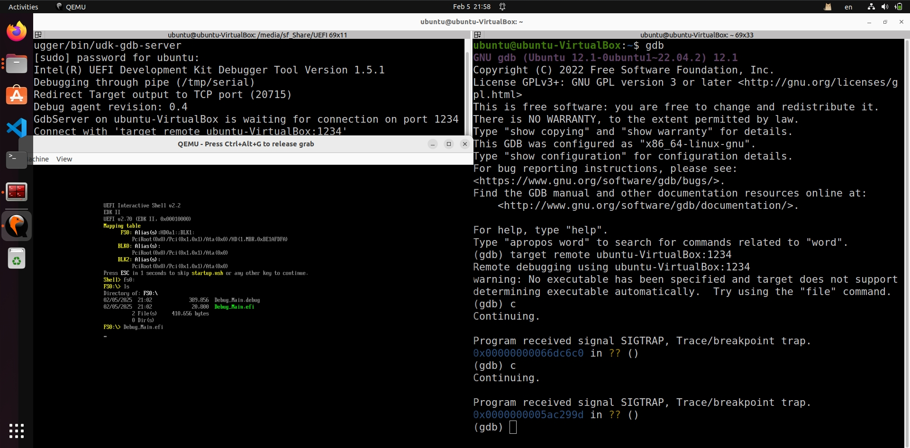

### 3) Load Debug Symbols

Run `Debug_Main.efi` and Load the debug symbols for `Debug_Main.efi`:

```bash
(gdb) source /opt/intel/udkdebugger/script/udk_gdb_script
```

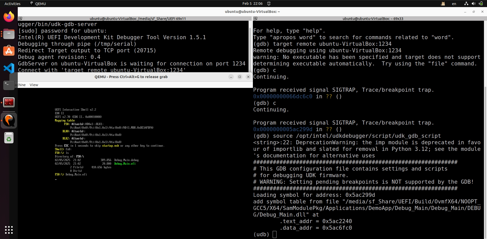

### 4) View Source Code

To view the source code of `Debug_Main.efi`, run:

```bash
l Debug_Main
```

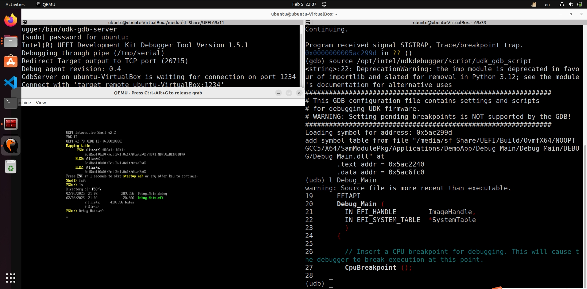

### 5) Step Through Code

Use the following commands to step through the code:

- `n` (next): Execute the next line of code.
- `c` (continue): Continue execution until the next breakpoint.

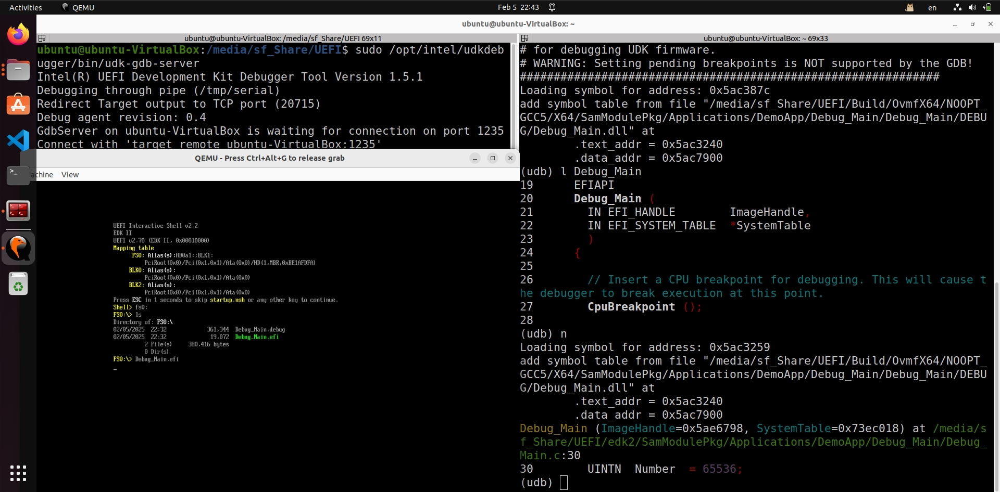

### 6) Inspect Variables

To inspect the value of a variable, use:

```bash
p <variable_name>
```

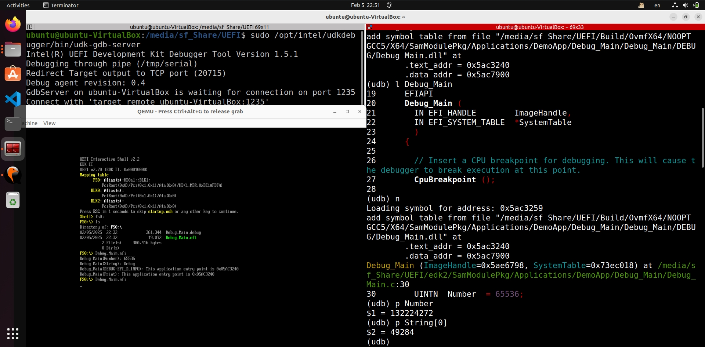

### 7) Complete Execution

To allow the application to complete execution, run:

```bash
c
```

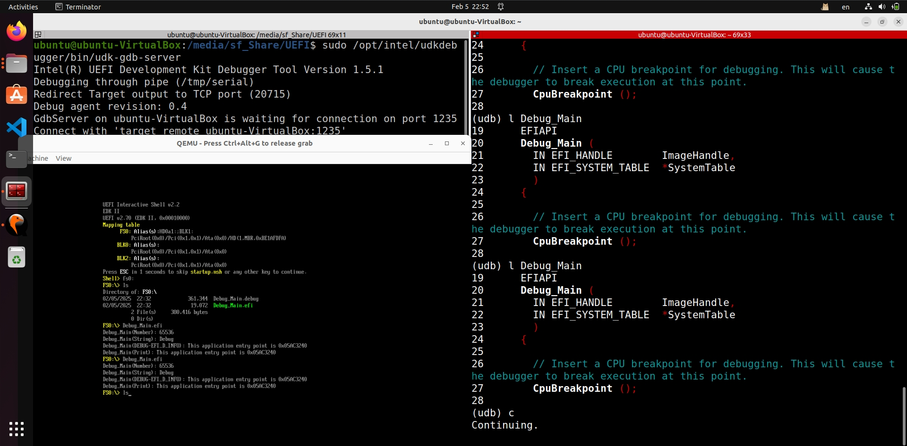

---

## Additional Resources

For more detailed instructions, refer to the *UDK_Debugger_Tool_User_Manual*.
