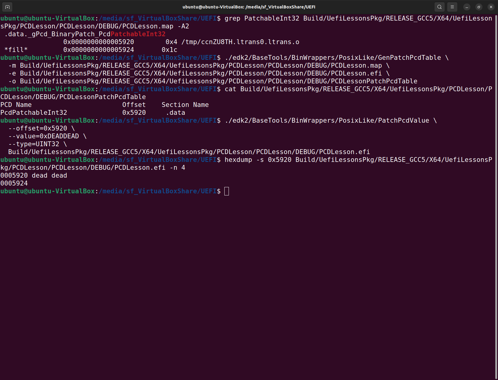
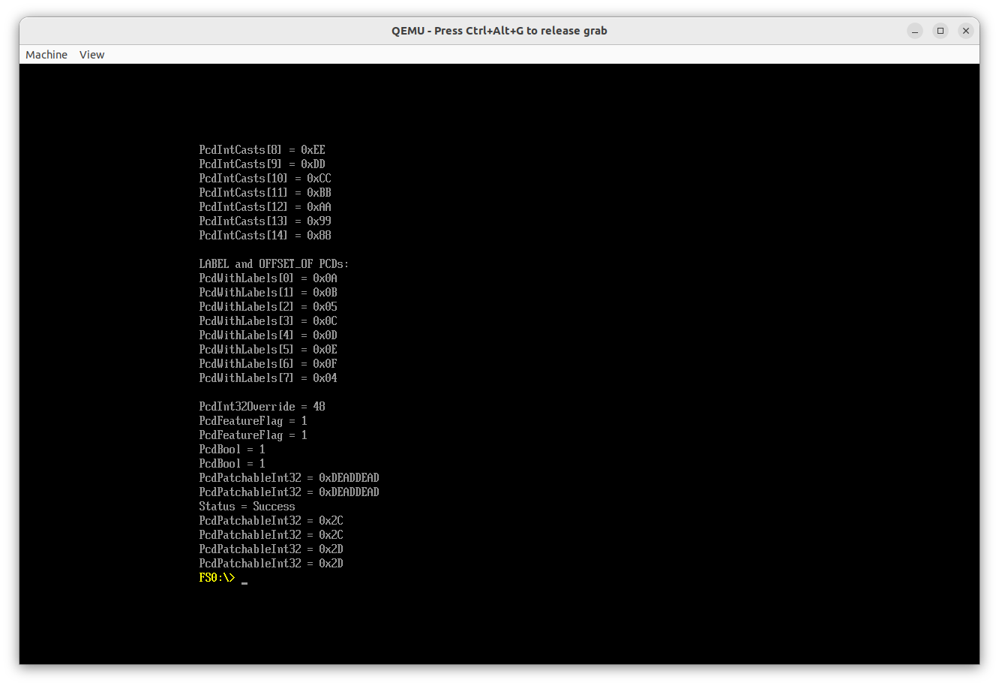

# Modify PatchPcd

Let's start with `GenPatchPcdTable`.

First check out help for this tool:

```SHELL
$ ./edk2/BaseTools/BinWrappers/PosixLike/GenPatchPcdTable -h
Usage: GenPatchPcdTable.py -m <MapFile> -e <EfiFile> -o <OutFile>

Copyright (c) 2008 - 2018, Intel Corporation. All rights reserved.

Options:
  --version             show program's version number and exit
  -h, --help            show this help message and exit
  -m MAPFILE, --mapfile=MAPFILE
                        Absolute path of module map file.
  -e EFIFILE, --efifile=EFIFILE
                        Absolute path of EFI binary file.
  -o OUTFILE, --outputfile=OUTFILE
                        Absolute path of output file to store the got
                        patchable PCD table.
```

Now let's create a `PatchPcdTable` for our app:

For the `*.efi` file we can use one of:

```SHELL
Build/UefiLessonsPkg/RELEASE_GCC5/X64/PCDLesson.efi 
Build/UefiLessonsPkg/RELEASE_GCC5/X64/UefiLessonsPkg/PCDLesson/PCDLesson/OUTPUT/PCDLesson.efi
Build/UefiLessonsPkg/RELEASE_GCC5/X64/UefiLessonsPkg/PCDLesson/PCDLesson/DEBUG/PCDLesson.efi
```

For the *.map file we can use one of:

```SHELL
Build/UefiLessonsPkg/RELEASE_GCC5/X64/UefiLessonsPkg/PCDLesson/PCDLesson/DEBUG/PCDLesson.map
Build/UefiLessonsPkg/RELEASE_GCC5/X64/UefiLessonsPkg/PCDLesson/PCDLesson/OUTPUT/PCDLesson.map
```

In case you wonder how our PCD can be found in a map file, execute:

```SHELL
grep PatchableInt32 Build/UefiLessonsPkg/RELEASE_GCC5/X64/UefiLessonsPkg/PCDLesson/PCDLesson/DEBUG/PCDLesson.map -A2
 .data._gPcd_BinaryPatch_PcdPatchableInt32
                0x0000000000005920        0x4 /tmp/ccnZU8TH.ltrans0.ltrans.o
 *fill*         0x0000000000005924       0x1c 
```

So as you can see the default value for our PCD is placed under the 0x5920 offset.

Now let's execute `GenPatchPcdTable` and create a file `PCDLessonPatchPcdTable` in the app Build `DEBUG` folder:

```SHELL
./edk2/BaseTools/BinWrappers/PosixLike/GenPatchPcdTable \
  -m Build/UefiLessonsPkg/RELEASE_GCC5/X64/UefiLessonsPkg/PCDLesson/PCDLesson/DEBUG/PCDLesson.map \
  -e Build/UefiLessonsPkg/RELEASE_GCC5/X64/UefiLessonsPkg/PCDLesson/PCDLesson/DEBUG/PCDLesson.efi \
  -o Build/UefiLessonsPkg/RELEASE_GCC5/X64/UefiLessonsPkg/PCDLesson/PCDLesson/DEBUG/PCDLessonPatchPcdTable
```

Checkout the created `PCDLessonPatchPcdTable` file.

```SHELL
cat Build/UefiLessonsPkg/RELEASE_GCC5/X64/UefiLessonsPkg/PCDLesson/PCDLesson/DEBUG/PCDLessonPatchPcdTable
PCD Name                       Offset    Section Name
PcdPatchableInt32              0x5920     .data 
```

As you can see it has the same offset that we've seen in a map file.

Now let's get a final look at our default PCD value in an *.elf file:

```SHELL
hexdump -s 0x5920 Build/UefiLessonsPkg/RELEASE_GCC5/X64/UefiLessonsPkg/PCDLesson/PCDLesson/DEBUG/PCDLesson.efi -n 4
```

Checkout help for the `PatchPcdValue` tool:

```SHELL
$ ./edk2/BaseTools/BinWrappers/PosixLike/PatchPcdValue -h
Usage: PatchPcdValue.py -f Offset -u Value -t Type [-s MaxSize] <input_file>

Copyright (c) 2010 - 2018, Intel Corporation. All rights reserved.

Options:
  -f PCDOFFSET, --offset=PCDOFFSET
                        Start offset to the image is used to store PCD value.
  -u PCDVALUE, --value=PCDVALUE
                        PCD value will be updated into the image.
  -t PCDTYPENAME, --type=PCDTYPENAME
                        The name of PCD data type may be one of VOID*,BOOLEAN,
                        UINT8, UINT16, UINT32, UINT64.
  -s PCDMAXSIZE, --maxsize=PCDMAXSIZE
                        Max size of data buffer is taken by PCD value.It must
                        be set when PCD type is VOID*.
  -v, --verbose         Run verbosely
  -d LOGLEVEL, --debug=LOGLEVEL
                        Run with debug information
  -q, --quiet           Run quietly
  -?                    show this help message and exit
  --version             show program's version number and exit
  -h, --help            show this help message and exit
```

Now use it to patch our PCD in an *.elf file:

```SHELL
./edk2/BaseTools/BinWrappers/PosixLike/PatchPcdValue \
  --offset=0x5920 \
  --value=0xDEADDEAD \
  --type=UINT32 \
  Build/UefiLessonsPkg/RELEASE_GCC5/X64/UefiLessonsPkg/PCDLesson/PCDLesson/DEBUG/PCDLesson.efi
```

Look at hexdump again:

```SHELL
$ hexdump -s 0x5920 Build/UefiLessonsPkg/RELEASE_GCC5/X64/UefiLessonsPkg/PCDLesson/PCDLesson/DEBUG/PCDLesson.efi -n 4
00055a0 dead dead
00055a4
```



We've successfully changed our PCD in a binary!

Now copy the modified `Build/UefiLessonsPkg/RELEASE_GCC5/X64/UefiLessonsPkg/PCDLesson/PCDLesson/DEBUG/PCDLesson.efi` file to the UEFI shared disk and execute our app under OVMF:

```SHELL
FS0:\> PCDLesson.efi
PcdPatchableInt32 = 0xDEADDEAD
PcdPatchableInt32 = 0xDEADDEAD
Status = Success
PcdPatchableInt32 = 0x2C
PcdPatchableInt32 = 0x2C
PcdPatchableInt32 = 0x2D
PcdPatchableInt32 = 0x2D
```


